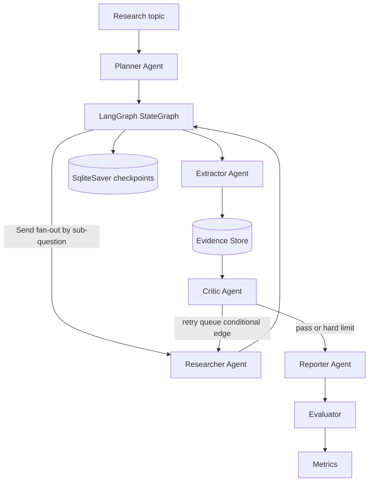

# DeepResearchAgent

DeepResearchAgent is a runnable deterministic MVP for a multi-agent deep research system. Every report claim is backed by structured evidence, Critic feedback can trigger retry research, citations are verified against the Evidence Store, evaluation produces quality/cost/latency metrics, and checkpoint recovery is demoable from the command line.

The current implementation runs without external LLM or search keys by default. It uses deterministic local agents, fixture search by default, fixture structured finance data by default, LangGraph orchestration with SQLite checkpointing, SQLite evidence/metrics persistence, FastAPI and Streamlit demo surfaces, and provider boundaries for optional future integrations. An opt-in LiteLLM mode is available for Planner, Extractor, and Reporter; Researcher search/data execution and Critic checks remain deterministic.

## Why It Matters

- Evidence Store: claim-source-subquestion traceability is the source of truth, not vector memory.
- Critic loop: missing citations, numeric conflicts, stale sources, missing counterarguments, and unverified projections are surfaced before reporting.
- Evaluation Harness: deterministic regression cases, Golden Set v1, frozen-corpus replay, judge-based scoring, citation support checks, bad-case categories, cost, latency, and token accounting can be compared across rounds.
- Finance data pack: whitelisted AKShare-backed structured data records normalize entity, metric, period, dimension, value, and unit for financial fact checks.
- Checkpoint recovery: long-horizon runs can pause after an intermediate phase and resume by `research_id`.

## Architecture



The researcher fans out sub-questions through LangGraph `Send` and then joins results before extraction. The default search provider is the deterministic fixture provider; Tavily is optional and only used when explicitly configured with a key.

## Modes And Keys

Deterministic mode is the default and requires no keys:

```bash
PYTHONPATH=src DEEPRESEARCH_SEARCH_PROVIDER=fixture .venv/bin/python scripts/run_demo.py --mode deterministic
```

LLM mode uses LiteLLM for Planner, Extractor, and Reporter while keeping fixture retrieval and deterministic Critic:

```bash
PYTHONPATH=src DEEPRESEARCH_SEARCH_PROVIDER=fixture .venv/bin/python scripts/run_demo.py --mode llm
```

LLM keys are read only from `.env`; do not export or log key values. Set
`DEEPSEEK_API_KEY` for LLM-mode Planner, Extractor, and Reporter. Set
`DASHSCOPE_API_KEY` for Golden Set judge and citation-support runs. Set
`TAVILY_API_KEY` only when recording live search fixtures.

## Quick Start

Use Python 3.11 or 3.12 for the local runtime. The examples below use a repo-local virtual environment:

```bash
python3.12 -m venv .venv
.venv/bin/python -m pip install -e ".[dev]"
```

Run the deterministic demo:

```bash
PYTHONPATH=src DEEPRESEARCH_SEARCH_PROVIDER=fixture .venv/bin/python scripts/run_demo.py
```

Run a small evaluation sweep:

```bash
PYTHONPATH=src DEEPRESEARCH_SEARCH_PROVIDER=fixture .venv/bin/python scripts/run_eval.py --limit 5
```

Compare evaluation metrics against the deterministic baseline:

```bash
PYTHONPATH=src DEEPRESEARCH_SEARCH_PROVIDER=fixture .venv/bin/python scripts/run_eval.py --limit 5 --compare-baseline
```

LLM-mode metrics use real LiteLLM token and cost accounting from `data/runtime/llm_ledger.jsonl`. In LLM mode, `citation_accuracy` is `null` with a reason because the current scorer is extractive-only; `citation_resolution_rate`, `citation_repair_retry_rate`, `uncited_claim_rate`, and `critic_catch_rate` remain programmatic. Golden Set rounds use a separate qwen3.7-plus judge for four-dimensional scoring and semantic citation support.

Run the checkpoint resume demo:

```bash
PYTHONPATH=src DEEPRESEARCH_SEARCH_PROVIDER=fixture .venv/bin/python scripts/run_checkpoint_demo.py
```

Run tests with the built-in `unittest` suite:

```bash
PYTHONPATH=src DEEPRESEARCH_SEARCH_PROVIDER=fixture .venv/bin/python -m unittest discover -s tests
```

Run a Golden Set v1 judge round from saved states:

```bash
PYTHONPATH=src PYTHONDONTWRITEBYTECODE=1 .venv/bin/python scripts/run_golden_round.py \
  --questions data/golden_set/v1/questions.json \
  --output data/golden_set/v1/results/round1.json \
  --work-dir _collab/006r3_recording-completion/round1 \
  --round-id round1 \
  --as-of 2026-07-09 \
  --ledger-path _collab/006r3_recording-completion/round_llm_ledger.jsonl \
  --judge-samples 3 \
  --state-path-map _collab/006r3_recording-completion/state_path_map.json
```

Open the no-dependency fallback UI/API:

```bash
PYTHONPATH=src DEEPRESEARCH_SEARCH_PROVIDER=fixture .venv/bin/python scripts/dev_server.py --port 8765
```

Start the API and UI in separate terminals:

```bash
PYTHONPATH=src .venv/bin/uvicorn deepresearch_agent.api.main:app --host 0.0.0.0 --port 8000
```

```bash
PYTHONPATH=src .venv/bin/streamlit run ui/app.py
```

Or use Docker:

```bash
docker compose up --build
```

## Public Demo Architecture

The deployable demo has three layers:

- Showcase layer: precomputed G3 reports and Golden Set methodology from `data/demo/g3_showcase.json`; no LLM or search calls.
- Golden rerun layer: selected Golden Set questions rerun through LLM mode with frozen-corpus replay and recorded structured-data fixtures; Tavily credit usage is zero.
- Owner live layer: free-form topic plus live Tavily search, available only when `X-Demo-Owner-Token` matches `DEMO_OWNER_TOKEN`.

Both paid layers share a persistent daily LLM spend guard. The default limit is
`DEEPRESEARCH_DEMO_DAILY_LLM_LIMIT_CNY=5.0`; once reached, rerun and live calls
return HTTP 429 while the showcase layer remains available. LangSmith tracing is
enabled only when `LANGSMITH_API_KEY` exists.

The current branch-B deployment state has no public URL because server
deployment credentials are absent from `.env`. Self-deployment instructions are
in [docs/deployment.md](docs/deployment.md).

For public URL smoke checks and the recording checklist, see [docs/deployment.md](docs/deployment.md).

## Optional Tavily Search

The deterministic MVP and CI do not require `TAVILY_API_KEY`. If the provider is set to `tavily` but the key is empty, the code falls back to local fixtures:

```bash
DEEPRESEARCH_SEARCH_PROVIDER=tavily TAVILY_API_KEY= \
  PYTHONPATH=src .venv/bin/python scripts/run_demo.py \
  --output artifacts/tavily_no_key/report.md
```

To make live Tavily search calls locally, set both variables explicitly:

```bash
export DEEPRESEARCH_SEARCH_PROVIDER=tavily
export TAVILY_API_KEY=<your-key>
PYTHONPATH=src .venv/bin/python scripts/run_demo.py \
  --output artifacts/tavily_live/report.md
```

## Local Output Examples

Deterministic demo:

```text
research_id=<uuid>
phase=done status=done
report=/.../artifacts/demo_report.md
```

Evaluation with baseline diff:

```text
Baseline comparison:
- status: pass
- quality metrics emitted
- operational metrics emitted
```

Checkpoint resume demo:

```text
paused_phase=critiquing paused_status=paused
paused_evidence_count=35
resumed_phase=done resumed_status=done
final_evidence_count=35
report=/.../artifacts/checkpoint_demo/report.md
```

## API Contract

- `POST /research`: create a research run from `{ "topic": "...", "depth_level": 2 }`
- `GET /research/{id}`: inspect checkpointed state
- `GET /research/{id}/report`: fetch JSON containing the markdown report
- `GET /metrics`: fetch recent evaluation results

FastAPI is the primary API demo surface. `scripts/dev_server.py` is a no-dependency fallback implemented with Python's standard library; it exposes the same JSON routes for local smoke demos and adds a small browser form at `/`. Both surfaces execute the deterministic MVP synchronously today; there is no background job queue or async run orchestration yet.

The Streamlit UI calls the FastAPI demo API. Under Docker Compose, the API and
UI share `data/runtime` for local SQLite, LLM ledgers, and the persistent demo
guard.

## What Is Implemented

- LangGraph `StateGraph` orchestration for `Planner -> Researcher -> Extractor -> Critic -> Reporter -> Evaluator`
- Researcher fan-out by sub-question with deterministic join and evidence ordering
- Official `SqliteSaver` checkpoints with resume by `research_id`
- SQLite-backed local Evidence Store and evaluation metrics
- LiteLLM-backed opt-in mode for Planner, Extractor, and Reporter
- LLM ledger with token, cost, latency, cache-hit field, repair attempts, and per-run budget fuse
- AKShare-backed structured finance provider with fixture/live modes for symbol resolve, financial indicators, and price history summaries
- Five-element numeric claim fields: entity, metric, period/timepoint, dimension, value, and unit
- Critic checks for missing citations, finance-aware numeric conflicts, temporal conflicts, outdated sources, missing counterarguments, and unverified projections
- Deterministic fixture search by default, with optional Tavily search behind the `SearchProvider` contract
- 50-case deterministic CI regression set in `data/eval_set_deterministic.jsonl`
- Golden Set v1 under `data/golden_set/v1/` with 30 finance questions, frozen-corpus replay methodology, qwen3.7-plus judge rounds, and round diff assets
- Streamlit dashboard for report, evidence, and Critic JSON
- Docker Compose for API/UI, with a Postgres profile reserved for production hardening

## Roadmap

Provider work is optional and must preserve the deterministic no-key MVP. See [docs/provider_integration.md](docs/provider_integration.md) for the rollout contract.

- Add robust live `web_fetch`.
- Add `rag_search`.
- Add Researcher reflection loop and live retrieval expansion.
- Add Critic semantic verification beyond deterministic issue rules.
- Operationalize LLM-as-Judge inside normal LLM-mode metrics beyond the offline Golden Set runner.
- Add a Postgres adapter using `docs/postgres_schema.sql`.
