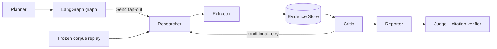

# DeepResearchAgent

一个以证据、引用与批判回路为核心，并用冻结语料可复现实测的金融投研深度研究 Agent。

[Live Demo](https://deepresearch-agent.jacksonyu1109.workers.dev/) · [Evaluation](docs/evaluation.md) · [Deployment](docs/deployment.md)

## Golden v1.1 release

| Metric | G3 value |
| --- | ---: |
| Composite | 0.7982 |
| Fact accuracy | 0.8867 |
| Citation support rate (3-sample claim majority) | 0.7376 |
| Citation resolution | 0.9333 |
| Uncited claim rate | 0.0779 |
| False-premise behavior | 2/2 in G1/G2/G3 |

All cards use Golden Set v1.1 and the locked `qwen3.7-plus` judge/verifier.

## Why this is different

**Judge effect decomposition.** Historical score movements are separated from generation changes. The judge-identity example remains explicitly labelled as measured on gold v1.0.

**The production line audited itself.** A four-key audit found 19 bad gold slots, then made entity, normalized metric, period, scope/unit, and numeric excerpt checks permanent write-time gates.

**False premises are refuted.** Both adversarial questions are rejected by all three saved generations instead of being answered as though the premise were true.

## Reproduce

1. Create `.venv` and install `.[dev]`.
2. Run `PYTHONPATH=src DEEPRESEARCH_SEARCH_PROVIDER=fixture .venv/bin/python -m unittest discover -s tests`.
3. Build the static showcase with `PYTHONPATH=src .venv/bin/python scripts/build_site.py`.

<!-- Screenshot placeholders: add (1) site metric cards, (2) report-page citation highlighting, and (3) methodology page. These comments render nothing. -->

## Non-goals and boundaries

- Vector retrieval: Evidence Store provenance is the current audit primitive.
- A/B framework: the release focuses on deterministic regression and saved-state replay.
- HITL: no reviewer workflow is implemented in this MVP.
- Always-on server and demo video: neither is required for the static demonstration surface.

This is a single-user demo, bounded by deepseek-v4-flash capability, public A-share disclosures, and an engineering regression set of N=30 rather than an academic benchmark.

## Roadmap

- Close the `fact_coverage` gap.
- Extend retained provenance to individual claims.
- Recheck recorded finance facts with AKShare live when the path is available.
- Add a retrieval-depth trigger for hard questions.
