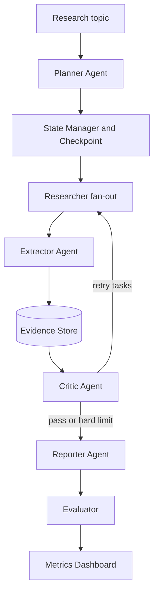

# DeepResearchAgent

DeepResearchAgent is a runnable MVP for a multi-agent deep research system. It is built around the resume-grade differentiators from the project plan: Critic feedback, Evidence Store, Citation Verification, checkpoint recovery, and an Evaluation Harness.

The local MVP is deterministic and can run without external LLM/search keys. The production path is prepared through `pyproject.toml`, Docker, FastAPI, Streamlit, and clear tool boundaries.

## Architecture



## Quick Start

Run the deterministic demo:

```bash
PYTHONPATH=src python scripts/run_demo.py
```

Run a small evaluation sweep:

```bash
PYTHONPATH=src python scripts/run_eval.py --limit 5
```

Run tests with the built-in `unittest` suite:

```bash
PYTHONPATH=src python -m unittest discover -s tests
```

Open the no-dependency fallback UI/API:

```bash
PYTHONPATH=src python scripts/dev_server.py --port 8765
```

With dependencies installed, start the API and UI in separate terminals. If needed, install the package once first:

```bash
pip install -e .
```

Terminal 1: FastAPI

```bash
uvicorn deepresearch_agent.api.main:app --host 0.0.0.0 --port 8000
```

Terminal 2: Streamlit UI

```bash
streamlit run ui/app.py
```

Or use Docker:

```bash
docker compose up --build
```

## API Contract

- `POST /research`: create a research run from `{ "topic": "...", "depth_level": 2 }`
- `GET /research/{id}`: inspect checkpointed state
- `GET /research/{id}/report`: fetch JSON containing the markdown report
- `GET /metrics`: fetch recent evaluation results

## What Is Implemented

- `Planner -> Researcher fan-out -> Extractor -> Evidence Store -> Critic -> Reporter -> Evaluator`
- SQLite-backed local Evidence Store and checkpoint table
- Critic checks for missing citations, numeric conflicts, outdated sources, missing counterarguments, and unverified projections
- 50-case golden question set in `data/eval_set.jsonl`
- Streamlit dashboard for report, evidence, and Critic JSON
- Docker Compose for API/UI, with a Postgres profile reserved for production hardening

## Production Hardening Backlog

- Replace `FixtureSearchTool` with Tavily/Serper and robust `web_fetch`
- Replace deterministic agents with LiteLLM-backed prompts in `prompts/`
- Add a Postgres adapter using `docs/postgres_schema.sql`
- Add LangGraph graph wiring once the dependency is installed
- Add CI metric-diff gating against `data/eval_set.jsonl`
