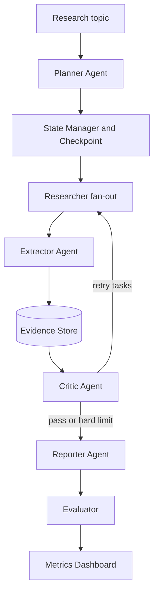

# DeepResearchAgent

DeepResearchAgent is a runnable MVP for a multi-agent deep research system. It is not a generic RAG demo: every report claim is backed by structured evidence, Critic feedback can trigger retry research, citations are verified against the Evidence Store, evaluation produces quality/cost/latency metrics, and checkpoint recovery is demoable from the command line.

The local MVP is deterministic and runs without external LLM/search keys. The production path is prepared through `pyproject.toml`, Docker, FastAPI, Streamlit, and provider/storage boundaries that keep Tavily, LiteLLM, and Postgres optional; LangGraph parity remains a future backlog item.

## Why It Matters

- Evidence Store: claim-source-subquestion traceability is the source of truth, not vector memory.
- Critic loop: missing citations, numeric conflicts, stale sources, missing counterarguments, and unverified projections are surfaced before reporting.
- Evaluation Harness: citation accuracy, faithfulness, Critic catch rate, bad-case categories, cost, latency, and token estimates can be compared against a baseline.
- Checkpoint recovery: long-horizon runs can pause after an intermediate phase and resume by `research_id`.

## Architecture



## Quick Start

Use Python 3.11 or 3.12 for the local runtime. The examples below use a repo-local virtual environment so they do not depend on a system `python` executable:

```bash
python3.12 -m venv .venv
.venv/bin/python -m pip install -e ".[dev]"
```

Run the deterministic demo:

```bash
PYTHONPATH=src .venv/bin/python scripts/run_demo.py
```

Run a small evaluation sweep:

```bash
PYTHONPATH=src .venv/bin/python scripts/run_eval.py --limit 5
```

Compare evaluation metrics against the deterministic baseline:

```bash
PYTHONPATH=src .venv/bin/python scripts/run_eval.py --limit 5 --compare-baseline
```

Run the checkpoint resume demo:

```bash
PYTHONPATH=src .venv/bin/python scripts/run_checkpoint_demo.py
```

Run tests with the built-in `unittest` suite:

```bash
PYTHONPATH=src .venv/bin/python -m unittest discover -s tests
```

Open the no-dependency fallback UI/API:

```bash
PYTHONPATH=src .venv/bin/python scripts/dev_server.py --port 8765
```

Start the API and UI in separate terminals:

```bash
.venv/bin/uvicorn deepresearch_agent.api.main:app --host 0.0.0.0 --port 8000
```

Streamlit UI:

```bash
.venv/bin/streamlit run ui/app.py
```

Or use Docker:

```bash
docker compose up --build
```

## Local Output Examples

Deterministic demo:

```text
research_id=<uuid>
phase=done status=done
report=/.../artifacts/demo_report.md
```

Evaluation with baseline diff:

```text
"cases": 5
"avg_citation_accuracy": 1.0
"avg_critic_catch_rate": 0.8
"avg_faithfulness": 0.923
Baseline comparison:
- status: pass
```

Checkpoint resume demo:

```text
paused_phase=critiquing paused_status=paused
paused_evidence_count=35
resumed_phase=done resumed_status=done
final_evidence_count=35
report=/.../artifacts/checkpoint_demo/report.md
```

Current UI/API packaging note: the Streamlit UI runs the local deterministic engine
directly, while FastAPI exposes the same research contract for API demos. Under
Docker Compose, both services use the same local storage path for the MVP. A
future production hardening step can wire the UI to the API via `API_BASE_URL`
or a similar setting.

## API Contract

- `POST /research`: create a research run from `{ "topic": "...", "depth_level": 2 }`
- `GET /research/{id}`: inspect checkpointed state
- `GET /research/{id}/report`: fetch JSON containing the markdown report
- `GET /metrics`: fetch recent evaluation results

FastAPI (`uvicorn deepresearch_agent.api.main:app`) is the primary API demo
surface and exposes the contract above. `scripts/dev_server.py` is a
no-dependency fallback implemented with Python's standard library; it exposes
the same JSON routes for local smoke demos and adds a small browser form at `/`.
Both surfaces execute the deterministic MVP synchronously today; there is no
background job queue or async run orchestration yet.

## What Is Implemented

- `Planner -> Researcher fan-out -> Extractor -> Evidence Store -> Critic -> Reporter -> Evaluator`
- SQLite-backed local Evidence Store and checkpoint table
- Critic checks for missing citations, numeric conflicts, outdated sources, missing counterarguments, and unverified projections
- 50-case golden question set in `data/eval_set.jsonl`
- Streamlit dashboard for report, evidence, and Critic JSON
- Docker Compose for API/UI, with a Postgres profile reserved for production hardening

## Production Hardening Backlog

- Replace `FixtureSearchTool` with Tavily/Serper and robust `web_fetch`
- Replace deterministic agents with LiteLLM-backed prompts in `prompts/`
- Add a Postgres adapter using `docs/postgres_schema.sql`
- Add LangGraph graph wiring once the dependency is installed
- Add CI metric-diff gating against `data/eval_set.jsonl`
