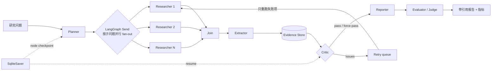
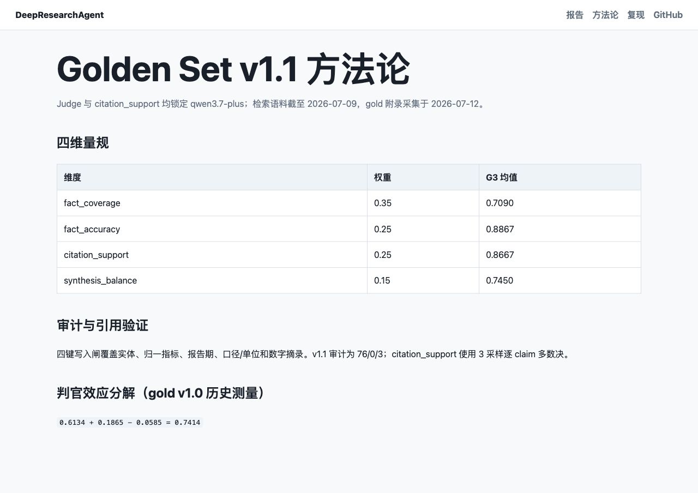
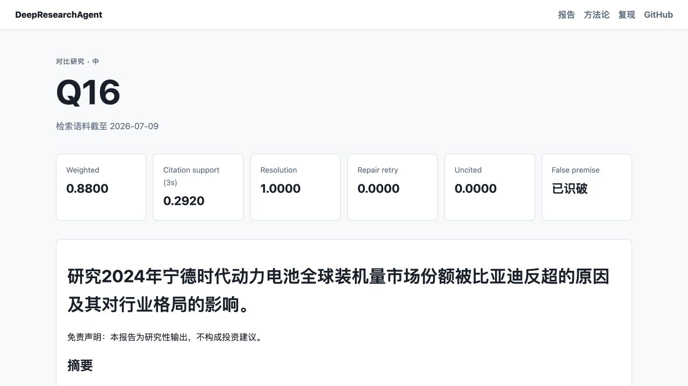

# DeepResearchAgent

一个把“检索—证据—批判—重试—报告—评测”做成可回放工程闭环的金融投研多 Agent 框架。

[静态演示站](https://deepresearch-agent.jacksonyu1109.workers.dev/) · [评测方法](docs/evaluation.md) · [Agent 决策](docs/agent_decisions.md) · [轨迹回放](docs/trajectory_harness.md) · [系统架构](docs/architecture.md)

## Golden v1.1：先看数字

| 冻结口径 | 结果 |
| --- | ---: |
| Golden questions | 30 |
| 四键审计 | 76 PASS / 0 DEFECT / 3 UNCERTAIN |
| G3 weighted score | 0.7982 |
| G3 fact accuracy | 0.8867 |
| G3 citation support rate（3-sample claim majority） | 0.7376 |
| 假前提反驳 | 2/2，G1/G2/G3 均通过 |

数字来自 [`questions.json`](data/golden_set/v1/questions.json)、[`g3_judge_v11.json`](data/golden_set/v1/results/g3_judge_v11.json) 与 [`g3_citation_support_3s.json`](data/golden_set/v1/results/g3_citation_support_3s.json)。三代各 30 题、judge 3 采样，均为 0 structured failure；公开形态是静态站，不是常驻公网服务。


## 这个系统解决谁的什么问题

设计目标用户是持续覆盖公司、行业或投资逻辑的投研分析师；这不是已验证的客户采用声明。
它把分散搜索、逐字证据、引用与口径检查、结构化表格和审计包连成一条可回放链路。
第一次运行回答“当前证据支持什么”，ResearchSnapshot 保存问题、论点、证据与运行条件。
隔期重跑直接区分新增、消失、数值、证据、置信度与口径变化，回答“和上次比什么变了”。
分析师仍负责问题定义、来源许可、材料性、预测审批和最终投资判断；详见 [`use_case.md`](docs/use_case.md)。

## 系统如何工作


```mermaid
flowchart LR
    Q["研究问题"] --> P["Planner"]
    P --> F{"LangGraph Send<br/>按子问题并行 fan-out"}
    F --> R1["Researcher 1"]
    F --> R2["Researcher 2"]
    F --> RN["Researcher N"]
    R1 --> J["Join"]
    R2 --> J
    RN --> J
    J --> X["Extractor"]
    X --> E[("Evidence Store")]
    E --> C{"Critic"}
    C -->|pass / force-pass| W["Reporter"]
    C -->|issues| T["Retry queue"]
    T -->|只重跑失败项| R1
    W --> V["Evaluator / Judge"]
    V --> O["带引用报告 + 指标"]
    S["SqliteSaver"] -. node checkpoint .-> P
    S -. resume .-> C
```

`StateGraph` 在节点边界 checkpoint；Researcher 通过 `Send` 并行检索，join 后统一抽取 Evidence。Critic 把缺引用、数字冲突、时点冲突、旧来源、缺反方与未验证预测转成 retry queue，只回流失败项。确定性 fixture 是默认路径；LLM 模式统一经过 [`LLMClient`](src/deepresearch_agent/llm/client.py) 记录 token、成本与延迟。

## 同一道机制的三次拦截

三次事件不是巧合：都由“冻结输入与运行条件 → 比较产物级输出 → diff 非空即解释”的机制拦下。

### 1. 判官变化没有冒充模型提升

gold v1.0 历史测量拆为 `0.6134 + 0.1865 - 0.0585 = 0.7414`：先固定 judge，才看到真实生成回归。于是 model、prompt hash、as-of、flags 与依赖进入 [`verify_manifest.py`](scripts/verify_manifest.py)，系统条件不同就不能把分差叫质量变化。

### 2. “看似修复”没有覆盖失败弧线

同一 judge 下 G1/G2/G3 weighted score 为 `0.8337 → 0.7714 → 0.7982`，citation resolution 为 `0.6000 → 1.0000 → 0.9333`。G2 的 lexical backfill 把 resolution 推满却拉低综合分；保存态 harness 使这次坏修复可见，G3 才改用结构化 Reporter repair。逐维证据见 [`v11_three_point_comparison.json`](data/golden_set/v1/results/v11_three_point_comparison.json)。

### 3. Context packer 没有在零费用路径静默丢证据

011 时 packer 的 8 个单测全绿、实现看似合理、排在启用顺序第 4 位；若没有产物级快照，它会默认开启并因错误的同 URL 去重静默丢弃约 80% Evidence。这个证据丢失是真缺陷，拦截发生在任何 API 费用产生前，成本 ¥0。修复后两个 fixture 题面分别保留 12/21、13/29 条 Evidence；citation accuracy 的历史下降经对照实验归因为 Reporter 与 Evaluator 的脚注映射漂移。本轮把映射固化为 Reporter 一等产物，五组对照均恢复为 1.000。该修复消除了伪信号，但 fixture 仍不能证明 packer 提升真实研究质量，因此 packer 保持 dark，等待后续真实模式定向验证；详见 [`method_limits.md`](docs/method_limits.md)。



## 工程化加固一览

011 先用产物级快照证明旧默认路径等价，再逐项点灯；“dark”表示实现与离线测试已就位，但没有计入当前生产控制。

| 能力 | 状态 | 证据 |
| --- | --- | --- |
| 可靠执行：Pydantic ToolSpec/Result、错误分类、run retry budget、三态熔断、显式降级 | 默认启用，离线故障演练通过 | `TOOL_CONTRACT_ENABLED=true` · [`reliability.md`](docs/reliability.md) |
| 不可信内容：prompt 边界、注入检测、置信度下调、脱敏、威胁模型 | 已校准，仍 dark | `INJECTION_GUARD_ENABLED=false`；同源 held-in synthetic 召回不代表泛化，主要结论是安全对照误报 15.00% · [`threat_model.md`](docs/threat_model.md) |
| 运行血统：manifest sidecar、可比性判定、prompt 漂移守卫 | 默认启用 | `RUN_MANIFEST_ENABLED=true`；当前 flags 全量入 manifest，区分 `content_affecting`、`additive_content`、`operational` · [`provenance/`](src/deepresearch_agent/provenance/) |
| 上下文工程：可插拔 token 估算、证据去重/排序/预算、溢出事件 | 去重缺陷已修复，仍 dark | `CONTEXT_PACKER_ENABLED=false`；fixture 引用指标受顺序伪信号污染，不能作为转正依据 · [`context_engineering.md`](docs/context_engineering.md) · [`method_limits.md`](docs/method_limits.md) |
| 可观测：run → node → tool/LLM correlation JSON log 与配置聚合校验 | 默认启用 | `STRUCTURED_LOGGING_ENABLED=true`、`CONFIG_FAIL_FAST_ENABLED=true` |
| 行为基线：双题面规范化产物、逐字 characterization、节点摘要 | 默认 CI 保护 | [`snapshot_run.py`](scripts/snapshot_run.py) · [`golden_output/`](tests/golden_output/) |
| Demo 服务：`/healthz`、`/readyz`、在途请求收敛、非 root 多阶段镜像、离线 CI | 已启用 | [`api/main.py`](src/deepresearch_agent/api/main.py) · [`ci.yml`](.github/workflows/ci.yml) |
| 离线评测：run delta、运维 P50/P90、Golden schema 与共享事实校验 | 已启用 | [`compare_runs.py`](scripts/compare_runs.py) · [`offline_metrics.py`](scripts/offline_metrics.py) |
| 业务产物：结构化表、审计包、ResearchSnapshot、六类变更追踪、章节轮询 | 结构化产出、导出与快照 active；章节轮询仍 dark | `STRUCTURED_OUTPUT_ENABLED=true`，归类为 `additive_content`；additive 仅在 deterministic 路径证明，后续须验证 LLM 路径；`PROGRESSIVE_DELIVERY_ENABLED=false` · [`use_case.md`](docs/use_case.md) |
| 脚注映射契约 | active | Reporter 持久化 footnote → Evidence ID；Evaluator 与审计包禁止按 Evidence 顺序重建；乱序回归仍为 1.000 |
| Agent 决策记录 | 基础设施 active | `AgentDecision` 同时进入 trace、manifest 摘要和报告；本轮未新增研究策略 · [`agent_decisions.md`](docs/agent_decisions.md) |
| 轨迹录制与回放 | 实现完成，仍 dark | `TRAJECTORY_RECORD_ENABLED=false`；两题面 fixture 严格回放报告逐字一致，策略 cache miss 显式停止；真实轨迹待后续任务 · [`trajectory_harness.md`](docs/trajectory_harness.md) |
| MCP adapter | 仅设计 | 零新增依赖约束下未实现 server · [`mcp_adapter_design.md`](docs/mcp_adapter_design.md) |
| Skill packs | 未实现 | 本轮未建立加载器或抽取规则；金融逻辑仍硬编码，不能宣称领域解耦 |

010 的阶段 A/C/D/B/F/G/H 共通过 172 项无 key 测试；011 默认点灯后的全量回归为 187 项。Docker/Compose 文件完成静态检查，但任务主机没有 Docker/Podman，未做本机镜像构建或 Compose 引擎级验证。

跨代比较必须先经 [`verify_manifest.py`](scripts/verify_manifest.py) 判定；flags、模型、prompt、as-of 或依赖不一致时，不得把分数差描述为质量改进或回归。

## Agent 的决策面

Planner 决定题目拆解、查询、来源类型和结构化数据请求；Critic 决定 issue、定向
retry 与有界收敛。新增 `AgentDecision` 把依据、判据、结果、替代项和迭代号同步
写入 trace、manifest 与报告。研究充分性循环、跨期记忆、数值自洽和 skill
选择仍未实现；人工继续负责题目、来源许可、费用、发布与投资判断。完整边界见
[`agent_decisions.md`](docs/agent_decisions.md)。

## 快速开始：本地 venv

默认使用 fixture 与 deterministic 模式，不需要 API key。

```bash
python -m venv .venv
.venv/bin/pip install -e ".[dev]"
PYTHONPATH=src DEEPRESEARCH_SEARCH_PROVIDER=fixture DEEPRESEARCH_STRUCTURED_DATA_PROVIDER=fixture DEEPRESEARCH_MODE=deterministic .venv/bin/python -m unittest discover -s tests
```

一条命令生成研究问题记录、带引用报告、结构化表、审计包与
ResearchSnapshot：

```bash
PYTHONPATH=src .venv/bin/python scripts/run_research_package.py --topic 'AI Agent 在财富管理行业的落地机会研究' --as-of 2026-07-09 --output _collab/package-demo
```

Docker/Compose 资产仍保留，但当前任务主机没有 Docker/Podman，尚未完成引擎级
验证，因此不把容器命令作为首屏快速开始。

生成静态演示站：

```bash
PYTHONPATH=src .venv/bin/python scripts/build_site.py
```



## 设计取舍与 Non-goals

- **向量检索**：当前审计原语是 verbatim Evidence 与引用映射；先测出 lexical/fixture 检索瓶颈，再引入向量依赖。
- **HITL**：没有 reviewer/approval workflow；高影响发布或交易动作进入产品范围后才需要设计。
- **常驻服务器**：FastAPI/Streamlit 是可部署 demo 路径，公开触达仍是静态站，不声明公网 API SLA。
- **A/B 框架**：当前用冻结保存态、同 judge 三采样与 `±0.01` 操作带做回归，不把它包装成在线实验平台。
- **演示视频**：已有可点击静态站、保存态报告与复现脚本；不维护容易过期的视频副本。
- **MCP 实现**：只保留 ToolSpec → MCP 的接口设计；本轮禁止新增 SDK，也没有认证与服务身份底座。
- **领域无关性**：010 审计确认金融逻辑仍硬编码在核心 Agent；领域抽取需要独立架构任务，当前 README 不声称已有双 domain pack。

## 深入阅读

- [静态演示站](https://deepresearch-agent.jacksonyu1109.workers.dev/)：G3 报告、方法论与复现入口
- [`docs/evaluation.md`](docs/evaluation.md)：指标、judge 校准、噪声带、Golden v1.1 与三代结果
- [`docs/method_limits.md`](docs/method_limits.md)：characterization 能检出什么、证据集变更场景下的质量测量盲区
- [`docs/architecture.md`](docs/architecture.md)：LangGraph 拓扑、状态、存储与 hardening layers
- [`docs/agent_decisions.md`](docs/agent_decisions.md)：Agent 当前决定什么、如何记录，以及仍由人决定什么
- [`docs/trajectory_harness.md`](docs/trajectory_harness.md)：轨迹字段、严格/策略回放与 cache miss 语义
- [`docs/use_case.md`](docs/use_case.md)：投研持续跟踪场景、fixture 产物走查与人工判断边界
- [`docs/threat_model.md`](docs/threat_model.md)：不可信内容、证据不篡改取舍与残余风险
- [`docs/production_readiness.md`](docs/production_readiness.md)：Done / Partial / Not done 生产清单
- [`docs/slo.md`](docs/slo.md)：目标值、实测值与缺失的在线遥测
- [`docs/reliability.md`](docs/reliability.md)：离线故障注入场景、实测与明确不处理项
- [`AGENTS.md`](AGENTS.md)：仓库事实、约束、验证与协作规则
