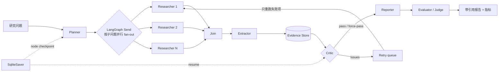

# DeepResearchAgent

一个把“检索—证据—批判—重试—报告—评测”做成可回放工程闭环的金融投研多 Agent 框架。

[静态演示站](https://deepresearch-agent.jacksonyu1109.workers.dev/) · [评测方法](docs/evaluation.md) · [系统架构](docs/architecture.md)

## Golden v1.1：先看数字

| 冻结口径 | 结果 |
| --- | ---: |
| Golden questions | 30 |
| 四键审计 | 76 PASS / 0 DEFECT / 3 UNCERTAIN |
| G3 weighted score | 0.7982 |
| G3 fact accuracy | 0.8867 |
| G3 citation support rate（3-sample claim majority） | 0.7376 |
| 假前提反驳 | 2/2，G1/G2/G3 均通过 |

数字来自 [`questions.json`](data/golden_set/v1/questions.json)、[`g3_judge_v11.json`](data/golden_set/v1/results/g3_judge_v11.json) 与 [`g3_citation_support_3s.json`](data/golden_set/v1/results/g3_citation_support_3s.json)。三代各 30 题、judge 3 采样，均为 0 structured failure；公开形态是静态站，不是常驻公网服务。


## 系统如何工作


```mermaid
flowchart LR
    Q["研究问题"] --> P["Planner"]
    P --> F{"LangGraph Send<br/>按子问题并行 fan-out"}
    F --> R1["Researcher 1"]
    F --> R2["Researcher 2"]
    F --> RN["Researcher N"]
    R1 --> J["Join"]
    R2 --> J
    RN --> J
    J --> X["Extractor"]
    X --> E[("Evidence Store")]
    E --> C{"Critic"}
    C -->|pass / force-pass| W["Reporter"]
    C -->|issues| T["Retry queue"]
    T -->|只重跑失败项| R1
    W --> V["Evaluator / Judge"]
    V --> O["带引用报告 + 指标"]
    S["SqliteSaver"] -. node checkpoint .-> P
    S -. resume .-> C
```

`StateGraph` 在节点边界 checkpoint；Researcher 通过 `Send` 并行检索，join 后统一抽取 Evidence。Critic 把缺引用、数字冲突、时点冲突、旧来源、缺反方与未验证预测转成 retry queue，只回流失败项。确定性 fixture 是默认路径；LLM 模式统一经过 [`LLMClient`](src/deepresearch_agent/llm/client.py) 记录 token、成本与延迟。

## 三个最值得讲的工程故事

### 1. 判官效应分解：先固定 judge，再谈模型变好

一次“提升”来自判官换人，而不是生成质量变化。gold v1.0 历史测量把它拆成 `0.6134 + 0.1865 - 0.0585 = 0.7414`：同一 G1 换 judge 后变为 `0.7999`，再用同一 judge 看 G2 才暴露真实回归；随后 G3 为 `0.7803`。因此 v1.1 把 model、prompt hash、as-of、flags 与依赖版本写进可比性规则，机制见 [`verify_manifest.py`](scripts/verify_manifest.py)。

### 2. 金标准生产线自我审判：19 个坏槽位成为阳性对照

v1.0 的来源筛选、抽取回填、冻结审查共享了同一个错误前提：“摘录看起来相关”被当成“值与槽位定义一致”。四键审计在 entity、normalized metric、period、scope/unit 上精确复现 19 个 DEFECT；v1.1 修复后为 76 PASS、0 DEFECT、3 个 PM UNCERTAIN。相同检查进入写入闸门，详见 [`gold_audit.py`](src/deepresearch_agent/evaluation/gold_audit.py) 与 [`freeze.md`](data/golden_set/v1/freeze.md)。

### 3. “看似修复”被 harness 抓住：三代保存态保留失败弧线

v1.1 同一 judge 下，G1/G2/G3 weighted score 为 `0.8337 → 0.7714 → 0.7982`；citation resolution 为 `0.6000 → 1.0000 → 0.9333`。G2 的 renderer lexical backfill 把 resolution 推满，却伴随综合分回归；G3 移除 backfill，改为结构化 Reporter repair retry，恢复真实测量并回收部分损失。项目保留三代而非覆盖失败结果，逐维证据在 [`v11_three_point_comparison.json`](data/golden_set/v1/results/v11_three_point_comparison.json)。


## 工程化加固一览

所有会改变运行行为的新增能力默认关闭；“dark”表示实现与离线测试已就位，但没有计入当前生产控制。

| 能力 | 状态 | 证据 |
| --- | --- | --- |
| 可靠执行：Pydantic ToolSpec/Result、错误分类、run retry budget、三态熔断、显式降级 | 已实现默认关闭（dark） | `TOOL_CONTRACT_ENABLED=false` · [`tools/`](src/deepresearch_agent/tools/) |
| 不可信内容：prompt 边界、注入检测、置信度下调、脱敏、威胁模型 | 已实现默认关闭（dark） | `INJECTION_GUARD_ENABLED=false` · [`threat_model.md`](docs/threat_model.md) |
| 运行血统：manifest sidecar、可比性判定、prompt 漂移守卫 | 已实现默认关闭（dark） | `RUN_MANIFEST_ENABLED=false`；prompt guard 已进 CI · [`provenance/`](src/deepresearch_agent/provenance/) |
| 上下文工程：可插拔 token 估算、证据去重/排序/预算、溢出事件 | 已实现默认关闭（dark） | `CONTEXT_PACKER_ENABLED=false` · [`context_engineering.md`](docs/context_engineering.md) |
| 可观测：run → node → tool/LLM correlation JSON log 与配置聚合校验 | 已实现默认关闭（dark） | `STRUCTURED_LOGGING_ENABLED=false`、`CONFIG_FAIL_FAST_ENABLED=false` |
| Demo 服务：`/healthz`、`/readyz`、在途请求收敛、非 root 多阶段镜像、离线 CI | 已启用 | [`api/main.py`](src/deepresearch_agent/api/main.py) · [`ci.yml`](.github/workflows/ci.yml) |
| 离线评测：run delta、运维 P50/P90、Golden schema 与共享事实校验 | 已启用 | [`compare_runs.py`](scripts/compare_runs.py) · [`offline_metrics.py`](scripts/offline_metrics.py) |
| MCP adapter | 仅设计 | 零新增依赖约束下未实现 server · [`mcp_adapter_design.md`](docs/mcp_adapter_design.md) |

阶段 A/C/D/B/F/G/H 共通过 172 项无 key 测试。Docker/Compose 文件完成静态检查，但任务主机没有 Docker/Podman，未做本机镜像构建或 Compose 引擎级验证。

## 快速开始：Docker Compose 三步

默认使用 fixture 与 deterministic 模式，不需要 API key。

```bash
# 1. 构建镜像
docker compose build

# 2. 启动 API 与 UI
docker compose up -d api ui

# 3. 检查 readiness
curl http://localhost:8000/readyz
```

本地零容器路径：

```bash
python -m venv .venv
.venv/bin/pip install -e ".[dev]"
PYTHONPATH=src DEEPRESEARCH_SEARCH_PROVIDER=fixture DEEPRESEARCH_STRUCTURED_DATA_PROVIDER=fixture DEEPRESEARCH_MODE=deterministic .venv/bin/python -m unittest discover -s tests
```

生成静态演示站：

```bash
PYTHONPATH=src .venv/bin/python scripts/build_site.py
```


## 设计取舍与 Non-goals

- **向量检索**：当前审计原语是 verbatim Evidence 与引用映射；先测出 lexical/fixture 检索瓶颈，再引入向量依赖。
- **HITL**：没有 reviewer/approval workflow；高影响发布或交易动作进入产品范围后才需要设计。
- **常驻服务器**：FastAPI/Streamlit 是可部署 demo 路径，公开触达仍是静态站，不声明公网 API SLA。
- **A/B 框架**：当前用冻结保存态、同 judge 三采样与 `±0.01` 操作带做回归，不把它包装成在线实验平台。
- **演示视频**：已有可点击静态站、保存态报告与复现脚本；不维护容易过期的视频副本。
- **MCP 实现**：只保留 ToolSpec → MCP 的接口设计；本轮禁止新增 SDK，也没有认证与服务身份底座。
- **领域无关性**：010 审计确认金融逻辑仍硬编码在核心 Agent；领域抽取需要独立架构任务，当前 README 不声称已有双 domain pack。

## 深入阅读

- [静态演示站](https://deepresearch-agent.jacksonyu1109.workers.dev/)：G3 报告、方法论与复现入口
- [`docs/evaluation.md`](docs/evaluation.md)：指标、judge 校准、噪声带、Golden v1.1 与三代结果
- [`docs/architecture.md`](docs/architecture.md)：LangGraph 拓扑、状态、存储与 hardening layers
- [`docs/threat_model.md`](docs/threat_model.md)：不可信内容、证据不篡改取舍与残余风险
- [`docs/production_readiness.md`](docs/production_readiness.md)：Done / Partial / Not done 生产清单
- [`docs/slo.md`](docs/slo.md)：目标值、实测值与缺失的在线遥测
- [`AGENTS.md`](AGENTS.md)：仓库事实、约束、验证与协作规则
