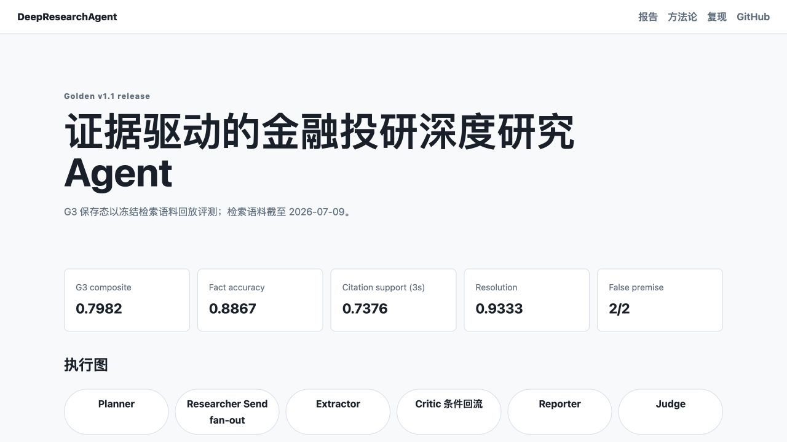
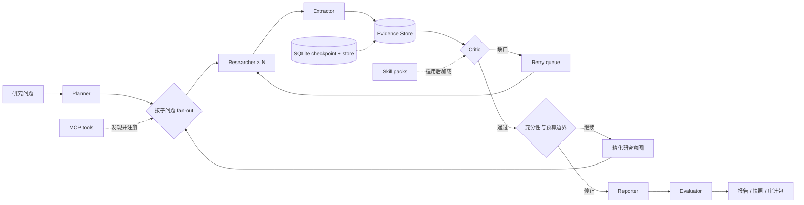

# DeepResearchAgent

## 让每一个研究结论，都经得起回看。

面向投研分析师的可审计深度研究 Agent：把一个研究问题变成带逐条证据、可比较快照和审计包的报告。

[](https://github.com/linqiaoyu/DeepResearchAgent/actions/workflows/ci.yml)


[Cloudflare Workers 静态演示站](https://deepresearch-agent.jacksonyu1109.workers.dev/) ·
[快速开始](#快速开始) ·
[系统架构](docs/architecture.md) ·
[评测方法](docs/evaluation.md) ·
[决策记录](docs/decisions/README.md) ·
[生产边界](docs/production_readiness.md)

分析师经常要在分散网页、财务口径、历史结论和引用之间来回核对；普通聊天式回答很难说明“这句话来自哪里”和“这次与上次相比什么变了”。DeepResearchAgent 把这些结果整理成一套可保存、可追溯、可复查的研究资产。当前首个场景是金融投研，默认使用本地 fixture，零 API key 即可运行；Round 087 的两份最终 live 包则在冻结的 60 文档 SEC 20-F 语料上验证了中文 NIO 与英文 PDD 报告。金融策略已通过显式 `DomainPack` 注入，但 finance 仍是唯一真实领域实现，不能据此宣称框架已经通用化；边界见 [architecture.md](docs/architecture.md)。



## 快速开始

默认路径是 deterministic + fixture，不读取付费 provider，也不需要 API key。

### 1. 安装

```bash
git clone https://github.com/linqiaoyu/DeepResearchAgent.git
cd DeepResearchAgent
python3.12 -m venv .venv
PYTHONDONTWRITEBYTECODE=1 .venv/bin/python -m pip install -e ".[dev]"
PYTHONDONTWRITEBYTECODE=1 .venv/bin/python scripts/doctor.py
```

### 2. 生成完整研究包

```bash
PYTHONPATH=src \
DEEPRESEARCH_SEARCH_PROVIDER=fixture \
DEEPRESEARCH_STRUCTURED_DATA_PROVIDER=fixture \
DEEPRESEARCH_MODE=deterministic \
.venv/bin/python scripts/run_research_package.py \
  --topic 'AI Agent 在财富管理行业的落地机会研究' \
  --as-of 2026-07-09 \
  --output _collab/package-demo
```

### 3. 查看结果

```bash
ls -1 _collab/package-demo
sed -n '1,120p' _collab/package-demo/report.md
```

该命令生成带引用报告、结构化表、Evidence、manifest、审计包和 `ResearchSnapshot`；字段与人工判断边界见 [use_case.md](docs/use_case.md)。

## 核心能力

| 能力 | 当前实现与证据 |
| --- | --- |
| 多 Agent 研究流程 | Planner、Researcher、Extractor、Critic、Reporter、Evaluator 由 LangGraph `StateGraph` 编排；Researcher 按子问题 fan-out，见 [architecture.md](docs/architecture.md)。 |
| 引用与证据闭合 | Reporter 固化 footnote → Evidence ID 映射，Evaluator 与审计导出复用同一契约，见 [citations.py](src/deepresearch_agent/citations.py) 和 [audit_bundle.py](src/deepresearch_agent/audit_bundle.py)。 |
| 有界研究循环与预算 | Critic retry、轮次、调用预算和连续无进展均有显式边界；分支预算默认开启，多轮研究默认关闭，且预算状态按 run 隔离，见 [orchestration_contracts.md](docs/orchestration_contracts.md)。 |
| 显式领域边界 | composition root 注入 finance `DomainPack`；核心对具体 finance pack 的 import 为 0，剩余金融字面量由 3 文件/8 处 allowlist 棘轮约束，见 [architecture.md](docs/architecture.md)。 |
| 可审计工具选择 | 默认确定性 selector 只从 `CapabilityRegistry` 选择 search、fetch、structured data 与 disclosure；LLM tool selection 默认关闭且复用相同授权与预算边界，见 [dynamic_capabilities.md](docs/dynamic_capabilities.md)。 |
| 可审计决策面 | 策略选择统一写入 `AgentDecision`、trace、manifest 和读者可见报告；缺失决策会被 `DecisionGate` 拦截，见 [agent_decisions.md](docs/agent_decisions.md)。 |
| 跨期研究 | `ResearchSnapshot` 区分新增、消失、数值、证据、置信度与口径 6 类变化，见 [change_tracking.md](docs/change_tracking.md)。 |
| MCP server | 标准库实现 JSON-RPC 2.0 over stdio，目标协议 `2025-06-18`，暴露研究、证据、审计导出、快照比较 4 个 fixture 工具，见 [server.py](src/deepresearch_agent/mcp/server.py)。 |
| MCP client | 标准库客户端可启动外部 server、发现工具、注册进原 `CapabilityRegistry`，并复用超时/重试/降级契约，见 [client.py](src/deepresearch_agent/mcp/client.py)。 |
| Skill packs | `SKILL.md` metadata-first 渐进披露；首个金融口径 pack 为 443 字节，SHA-256 `06f0c650…e34c2b0d`，默认 `SKILL_PACKS_ENABLED=false`，见 [finance-metric-normalization](skills/finance-metric-normalization/SKILL.md)。 |
| 评测与回归 | 本地零 key 完整门禁覆盖文档同步、领域边界、计划台账、Ruff、prompt drift、全量 unittest、demo/eval smoke 与受跟踪文件不变检查；唯一入口是 `PYTHONDONTWRITEBYTECODE=1 .venv/bin/python scripts/gate.py`。 |

## 它如何工作


```mermaid
flowchart LR
    Q["研究问题"] --> P["Planner"]
    P --> F{"按子问题 fan-out"}
    F --> R["Researcher × N"]
    R --> X["Extractor"]
    X --> E[("Evidence Store")]
    E --> C{"Critic"}
    C -->|"缺口"| T["Retry queue"]
    T --> R
    C -->|"通过"| B{"充分性与预算边界"}
    B -->|"继续"| P2["精化研究意图"]
    P2 --> F
    B -->|"停止"| W["Reporter"]
    W --> V["Evaluator"]
    V --> O["报告 / 快照 / 审计包"]
    M["MCP tools"] -. "发现并注册" .-> F
    S["Skill packs"] -. "适用后加载" .-> C
    K[("SQLite checkpoint + store")] -.-> E
```

1. Planner 把题目拆成可检索子问题；Researcher 并行收集 fixture 或已配置 provider 的来源。
2. Extractor 把来源转成带原文摘录的 Evidence；Critic 检查缺引用、数字冲突、时点冲突、旧来源、缺反方和未验证预测。
3. 只有失败项进入 retry queue；可选研究循环在充分性、预算或无进展边界处停止。
4. Reporter 输出带引用报告，Evaluator 复用 Reporter 的脚注映射；SQLite 保存 checkpoint、Evidence 与评测结果。

默认路径保持确定性。LLM 模式只经 [LLMClient](src/deepresearch_agent/llm/client.py) 调用并记录 token、成本、延迟与 cache；任何真实付费实验都必须按 [AGENTS.md](AGENTS.md) 预登记并获得当轮成本授权。

## 差异化亮点

### 三次拦截：同一套可复现机制

| 被拦截的问题 | 产物级证据 |
| --- | --- |
| Judge 变化被误写成模型提升 | 历史分解为 `0.6134 + 0.1865 - 0.0585 = 0.7414`；manifest 现在比较模型、prompt hash、as-of、flags 与依赖，见 [evaluation.md](docs/evaluation.md)。 |
| Citation resolution 满分掩盖综合退化 | G1/G2/G3 weighted score 为 `0.8337 → 0.7714 → 0.7982`，而 resolution 为 `0.6000 → 1.0000 → 0.9333`；保存态对比阻止把 G2 当成改进，见 [v11_three_point_comparison.json](data/golden_set/v1/results/v11_three_point_comparison.json)。 |
| Context packer 静默丢 Evidence | 产物快照曾在 ¥0 fixture 路径发现约 80% Evidence 丢失；修复后两题保留 `12/21` 与 `13/29` 条。Round 087 的受控 live A/B 将 NIO 报告的读者可见行数从 `18` 降至 `15`，因此该开关已默认开启；证据仍仅覆盖金融 SUT，见 [method_limits.md](docs/method_limits.md)。 |

### Agent 决策不是黑盒日志

预算分配、循环停止、跨期分类、数值自洽、能力选择、反思信号、MCP 发现和 skill 加载都复用同一 `AgentDecision`。每条记录包含输入、判据、结果、替代项和轮次；只读 `DecisionContext` 明确上游决定如何影响下游，见 [decision_weaving.md](docs/decision_weaving.md)。

### MCP 是双向边界

服务端把现有 `CapabilityRegistry` 机械映射成 4 个 MCP tool schema；客户端把外部 `tools/list` 结果注册回同一 registry，供动态能力选择使用。外部 annotations 默认不可信，未知工具按可能收费、有副作用、不可幂等 fail-closed；调用仍经过统一超时、重试、预算和降级契约，见 [mcp/client.py](src/deepresearch_agent/mcp/client.py)。

第三方全序列握手仍为 **INCOMPLETE**：外部客户端已验证发现序列，完整 `initialize → tools/list → tools/call` 只由仓库内最小 stdio 客户端验证；没有 authenticated hosted transport。当前边界与复现脚本见 [mcp.md](docs/mcp.md) 和 [mcp_stdio_client.py](scripts/mcp_stdio_client.py)。

### Skill pack 与 DomainPack 分工

金融数值口径表从 `data/` 迁到 [finance-metric-normalization](skills/finance-metric-normalization/SKILL.md)，迁移前后 SHA-256 一致。开启 skill pack 后，系统先读 `SKILL.md` 的 name/description，判定适用后才读取资源并注册能力；非适用用例的 resource reads 为 0。运行时领域策略则由显式 finance `DomainPack` 提供，两者不是同一扩展机制。当前尚无第二个真实 DomainPack，完整边界见 [skills.md](docs/skills.md)。

## 工程质量

| 检查面 | 已验证状态 |
| --- | --- |
| 全量回归 | 本地 deterministic + fixture 完整门禁；唯一标准入口为 `PYTHONDONTWRITEBYTECODE=1 .venv/bin/python scripts/gate.py`。 |
| 静态检查 | Ruff 版本由 [pyproject.toml](pyproject.toml) 精确锁定，本地 gate 与 CI 使用同一项目解释器和命令。 |
| 行为等价 | 2 个规范化题面逐字匹配 [golden_output](tests/golden_output/)；未知 manifest flag fail-closed，见 [manifest.py](src/deepresearch_agent/provenance/manifest.py)。 |
| 故障演练 | 8 个离线 chaos 场景覆盖认证、限流、超时、连续失败、熔断和部分降级，见 [tests/chaos](tests/chaos/)。 |
| Golden v1.1 | 30 questions；四键审计 `76 PASS / 0 DEFECT / 3 UNCERTAIN`；G3 weighted `0.7982`、fact accuracy `0.8867`、citation support `0.7376`，见 [Golden results](data/golden_set/v1/results/)。 |
| Round 087 最终 live 报告 | NIO 中文报告为 13 条读者可见行、0 条样板噪声、2/2 指标回答并含 1 个可追溯派生指标；PDD 英文报告为 11 条读者可见行、0 条样板噪声、1/2 指标回答且对缺口作显式说明。两者均使用 `SecCompanyFactsProvider`，并通过结构化 manifest 与引用闭合检查，见 [087 result](docs/decisions/087/result.md)。 |
| 公开形态 | [公开地址](https://deepresearch-agent.jacksonyu1109.workers.dev/) 是 `scripts/build_site.py` 生成的静态演示站，不是常驻 API 服务；部署边界见 [deployment.md](docs/deployment.md)。 |

## 诚实边界

- `REFLECTION_ENABLED=false`：四类确定性信号、占位推理接口、程序记忆与重规划接线已实现；Round 033 未观察到策略采用，不能宣称具备反思判断力，见 [reflection.md](docs/reflection.md)。
- `CONTEXT_PACKER_ENABLED=true`、`INJECTION_GUARD_ENABLED=false`、`RESEARCH_LOOP_ENABLED=false`、`DYNAMIC_CAPABILITY_ENABLED=true`、`BRANCH_BUDGET_ENABLED=true`、`SKILL_PACKS_ENABLED=false`：Round 087 的单开关 live A/B 已转正 context packer、numeric check、semantic judge 和 decision weaving；trajectory record 与 progressive delivery 已在 Round 109 作为 `operational` 默认开启（两者不改变 Evidence 集合或顺序）；research loop 与 skill packs 仍未观察到严格增益而保持关闭。开关默认值不等于所有主题的质量结论，见 [method_limits.md](docs/method_limits.md)。
- MCP 不暴露任意文件读取或命令执行；server 只允许服务端自管运行目录，付费路径需要显式 `allow_paid`，本轮 fixture server 即使确认也拒绝 LLM 执行，见 [server.py](src/deepresearch_agent/mcp/server.py)。
- 金融仍是当前唯一已实现的领域包；核心侧具体金融 import 由
  [`scripts/check_domain_boundary.py`](scripts/check_domain_boundary.py) 测量并以
  初始 `import_sites=6` 已迁移至当前 `import_sites=0`。剩余金融字面量为 3 个文件、
  9 行，均有受测 allowlist 与移除条件；尚无第二个真实领域实现，因此不能宣称框架已经
  领域通用，见 [architecture.md](docs/architecture.md)。
- Docker/Compose 资产存在，但当前验证主机没有 Docker/Podman，因此没有本机引擎级构建证据；现状见 [production_readiness.md](docs/production_readiness.md)。
- 分析师仍负责问题定义、来源许可、材料性、预测审批、发布和最终投资判断；本项目不构成投资建议，见 [use_case.md](docs/use_case.md)。

## 深入阅读

### 架构与运行

- [系统架构](docs/architecture.md)
- [编排契约、循环与分支预算](docs/orchestration_contracts.md)
- [Provider 集成](docs/provider_integration.md)
- [部署说明](docs/deployment.md)
- [Postgres 目标 schema](docs/postgres_schema.sql)
- [MCP 双向集成](docs/mcp.md)
- [Skill packs](docs/skills.md)
- [MCP adapter 原设计](docs/mcp_adapter_design.md)

### 研究、决策与记忆

- [持续投研用例](docs/use_case.md)
- [Agent 决策](docs/agent_decisions.md)
- [决策编织](docs/decision_weaving.md)
- [动态能力选择](docs/dynamic_capabilities.md)
- [数值自洽](docs/numeric_consistency.md)
- [反思骨架](docs/reflection.md)
- [研究记忆](docs/memory.md)
- [上下文工程](docs/context_engineering.md)
- [跨期变更追踪](docs/change_tracking.md)

### 评测、轨迹与边界

- [评测方法与 Golden 结果](docs/evaluation.md)
- [方法适用性边界](docs/method_limits.md)
- [轨迹录制与回放](docs/trajectory_harness.md)
- [历史 019 轨迹超集方案](docs/trajectory_superset.md)
- [历史决策记录索引](docs/decisions/README.md)
- [威胁模型](docs/threat_model.md)
- [可靠执行与故障演练](docs/reliability.md)
- [生产就绪度](docs/production_readiness.md)
- [SLO](docs/slo.md)

仓库级事实、开关默认值、协作纪律和付费预登记要求见 [AGENTS.md](AGENTS.md)。

## License

本项目采用 [MIT License](LICENSE)。
