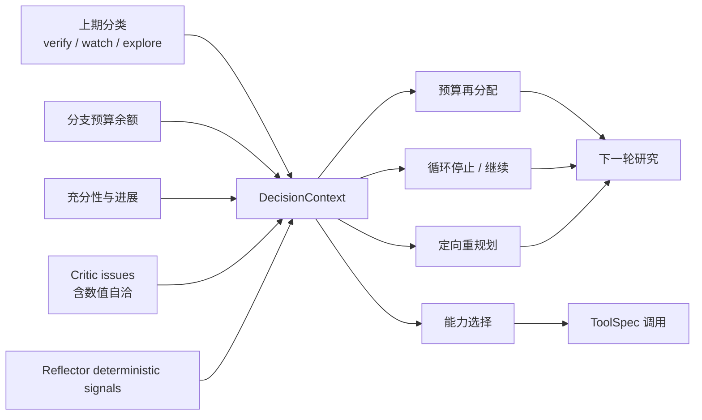

# Agent 如何通盘权衡

DeepResearchAgent 不把预算、历史结论、Critic 缺口和工具能力当成互不相干的局部变量。
开启 `DECISION_WEAVING_ENABLED` 后，编排层在每个关键边界构造同一个只读
`DecisionContext`，再由预算分配、循环停止、跨期分类和检索重规划读取。上下文包含：

- 每个分支的 allocated / used / remaining、运行总预算和 verify 最低额度；
- 六项充分性度量与上一轮进展；
- 最近期 `verify` / `watch` / `explore` 分类；
- Critic 未解决问题，包括数值自洽错误；
- Reflector 机械提取的跨轮策略信号；
- 已有 `AgentDecision` 摘要，供后续决策解释它继承了哪些前置判断。

这形成一条有方向的依赖链，而不是几个并排启发式：

例如，某个上期结论被标为 `verify` 时，预算器先保留最低复核额度；若剩余预算比例已低于
阈值，循环器会提前收敛并明确写出“因预算约束提前收敛”；若 Critic 同时发现
`numeric_inconsistency`，重规划器会把对应公式和 Evidence 定向带入补证意图。最终报告的
“决策链”按发生顺序展示预算、循环、历史、数值和能力决定，使读者能追溯“为什么这样研究”。

## 当前可审计决定

### 研究循环与预算

`BoundedLoop` 读取 Evidence 数量、独立来源、平均可信度、时效、未解决 issue、反方证据、
轮次、剩余调用预算和连续无进展次数，输出 `continue`、`stop_sufficient` 或带原因的
`stop_exhausted:*`。`BranchBudget` 在 fan-out 前受总量和单支上限约束地分配，join 后向
低充分性分支再分配；决策编织开启时还会为 `verify` 分支保留最低额度。

### 上期结论与下一轮意图

最近一期快照按四键匹配子问题：高置信且非 uncertain 为 `verify`，低置信或 uncertain 为
`watch`，没有覆盖为 `explore`。verify 可优先 fetch 旧来源，但必须保留独立检索。
重规划读取同一 `DecisionContext`：来源集中、缺反方、证据过旧、置信度不足以及 Critic
未解问题会生成不同查询；不会原样重跑。

### 数值自洽

`NUMERIC_CHECK_ENABLED` 开启后，Critic 校验同比/环比增长、份额、加总和单位换算。超过
绝对或相对容差的结果产生 `numeric_inconsistency`，必须记录声称值、计算值、公式、
Evidence IDs 和校验器；口径不可比则沿用 `numeric_conflict`，不伪造算术结论。每次检查和
整轮扫描都写入 `AgentDecision`，问题随后进入 retry queue 与重规划上下文。

### 动态能力选择

`DYNAMIC_CAPABILITY_ENABLED` 开启后，每个子问题先确定性分类为
`financial_metric`、`market_price`、`verify` 或 `narrative`，再只从
`CapabilityRegistry` 中选择已注册且满足 ToolSpec 的能力。决策记录候选、选中、拒绝及
fallback 理由；没有可用匹配时回退到 015 的固定三能力路径，不绕过预算、契约或工具边界。

### MCP 工具发现

`MCPStdioClient` 完成 `initialize` / `notifications/initialized` / `tools/list`
后产生 `mcp_tool_discovery` 决定。该决定记录 server 名、发现的远端工具、命名空间化后的
本地能力名，以及 trusted / untrusted 注解策略；注册动作声明
`MCP_DISCOVERY_NODE_CONTRACT` 并通过 `DecisionGate`。外部能力进入既有
`CapabilityRegistry`，调用继续受 ToolSpec、预算、超时、重试与降级约束。

未信任服务端的 annotations 不作为事实：cost、side effect 与 idempotency 均
fail-closed。这个决定只证明发现和注册过程可审计，不证明远端工具安全或提高研究质量。
协议和安全边界见 [`mcp.md`](mcp.md)。

### Skill 选择与加载

`SKILL_PACKS_ENABLED` 开启后，loader 先只读 `SKILL.md` metadata 并产生
`skill_selection` 决定；只有适用策略为 true 才读取 resources、注册能力，并产生
`skill_load` 决定。两步分别声明 `SKILL_SELECTION_NODE_CONTRACT` 与
`SKILL_LOAD_NODE_CONTRACT`，都通过 `DecisionGate`。选择记录适用判据和未选原因，
加载记录资源路径、能力名与读取结果，因此可以证明不适用路径没有资源读取。

首个 pack 只迁移金融指标归一规则表，不表示领域解耦完成。机制和剩余耦合见
[`skills.md`](skills.md)。

### 反思信号、程序性记忆与重规划

`REFLECTION_ENABLED` 开启后，Reflector 的两个新决定都复用 `AgentDecision`：

- `reflection_signal_extraction` 记录四类机械信号、读取的 trajectory/decision 片段与
  空信号类别；
- `procedural_memory_write` 记录按 `question_type` 写入的策略效果观察、`cross_run`
  lifecycle 与索引键。

只有确定性信号进入 `DecisionContext` 并影响既有重规划接口；LLM 推理接口本轮是零
token 合成/录制占位，`llm_insight` 不参与行为。反思判断质量与程序记忆策略优劣均待
019 真实模式验证，不能由 fixture 接线测试推出。

## 一个对象，三个审计落点

所有上述决定复用 `AgentDecision`：actor、测量输入、书面判据、结果、替代项、迭代号和
时间戳。它同时进入结构化 trajectory、run manifest 的 decision summary 和读者可见报告；
`DecisionGate` 会拒绝“声明为决策节点却没有新增决定”的执行。

`AgentDecision` 不保存一段无法复算的“思维过程”，而保存足以审计的输入、规则和结果。
`DecisionContext` 同样是深只读值对象，避免下游节点偷偷修改上游事实。

## 默认状态与证明边界

`DECISION_WEAVING_ENABLED=false`、`NUMERIC_CHECK_ENABLED=false`、
`DYNAMIC_CAPABILITY_ENABLED=false`；015 的 `BRANCH_BUDGET_ENABLED`、
`RESEARCH_LOOP_ENABLED` 与 `PRIOR_MEMORY_ENABLED` 也保持默认关闭；
`REFLECTION_ENABLED=false`、`SKILL_PACKS_ENABLED=false`。三项 016、一项 017
与一项 018 开关均为
`content_affecting`，关闭时不会进入 manifest 配置 payload，也不改变默认两题面产物。

零 API fixture 测试可以证明决策依赖被读取、算式检出可重复、能力选择不越过 registry、
报告审计链闭合以及严格回放逐字一致；不能证明阈值、重规划或能力组合提高真实网页与 LLM
研究质量。真实效果留给 019 的预登记、预算化成对验证。

人工仍负责题目、provider 与费用授权、来源许可与材料性、预测审批、对外发布，以及所有
投资或交易决定。Agent 无权自行联网付费、发布、交易或扩大研究范围。

实现和开关细节见 [`decision_weaving.md`](decision_weaving.md)、
[`numeric_consistency.md`](numeric_consistency.md)、
[`dynamic_capabilities.md`](dynamic_capabilities.md) 与
[`trajectory_superset.md`](trajectory_superset.md)，反思边界见
[`reflection.md`](reflection.md)。
