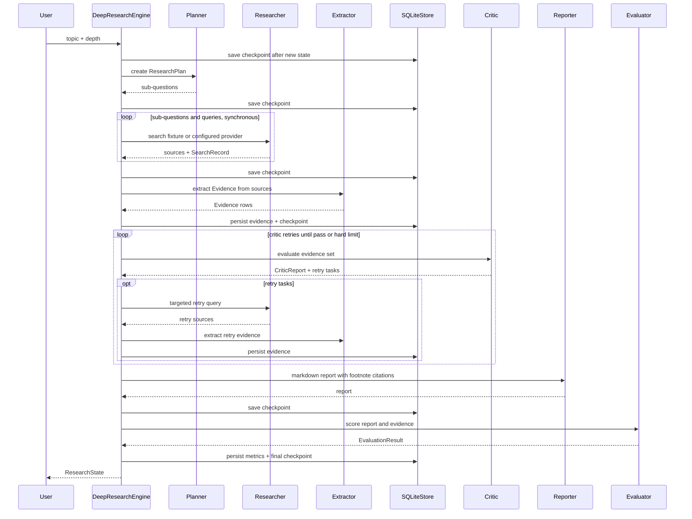

# Architecture

DeepResearchAgent is organized as a deterministic long-horizon research workflow with explicit quality gates and source-backed evidence.

## Current Execution Flow

The engine is currently a synchronous phase loop in `src/deepresearch_agent/workflow/engine.py`. LangGraph is installed as a project dependency, but the runtime graph migration is not active yet.

## Core Contracts

- `ResearchPlan`: topic, depth, sub-questions, estimated sources, success criteria
- `ResearchState`: workflow phase, status, plan, tasks, sources, evidence, critic report, report, metrics, token and cost estimates
- `Evidence`: claim, claim type, source URL/title/date, extract text, confidence
- `CriticReport`: pass/fail, quality score, issues, retry tasks, iteration
- `EvaluationResult`: task success, citation accuracy, critic catch rate, relevance, faithfulness, latency, cost, tokens

All cross-agent contracts are Pydantic models in `src/deepresearch_agent/schemas.py`.

## Current MVP Boundaries

- Search is behind a `SearchProvider` boundary. The default implementation is a deterministic `FixtureSearchTool`; Tavily is available as an opt-in adapter, while Serper is not implemented.
- Fetch has only a local fixture implementation through `FixtureSearchTool.fetch`; there is no robust live `web_fetch` yet.
- `rag_search` and `structured_query` are not implemented.
- State, checkpoints, evidence, and evaluations are persisted with `SQLiteStore` for the local MVP. `docs/postgres_schema.sql` documents a production storage path, but there is no Postgres adapter yet.
- FastAPI and the fallback stdlib server execute runs synchronously. The project does not yet include a background job queue.
- Checkpoint recovery is available through `research_id` and can be demonstrated with `scripts/run_checkpoint_demo.py`.
- LiteLLM is declared but not used; current agents are deterministic Python implementations.

## Checkpoint And Storage Responsibilities

`SQLiteStore` owns three local tables today:

- `checkpoints`: serialized `ResearchState` JSON keyed by `research_id`
- `evidence`: source-backed evidence rows keyed by evidence ID
- `evaluations`: serialized `EvaluationResult` keyed by `research_id`

The engine saves a checkpoint after each phase. A paused run stores the next phase, evidence collected so far, retry queue, Critic iteration, report draft, metrics, token count, and cost estimate. The engine can resume from `research_id` without discarding Evidence Store entries.

## LangGraph Migration Status

LangGraph 1.2.2 is installed and provides `StateGraph` and `Send`, but the current environment does not include the official SQLite checkpointer package. The installed `langgraph.checkpoint` namespace contains `base`, `memory`, and `serde`; `langgraph.checkpoint.sqlite` is not importable.

A compliant migration should wait for dependency approval for the official SQLite saver package, then move orchestration checkpointing to LangGraph while keeping `SQLiteStore` focused on evidence and evaluation persistence.

## Why Evidence Store Is First-Class

The project does not rely on vector memory as the source of truth. Each final claim must be backed by a structured `Evidence` row with an extract from the source. This makes citation verification, numeric conflict detection, and interview explanations concrete.
