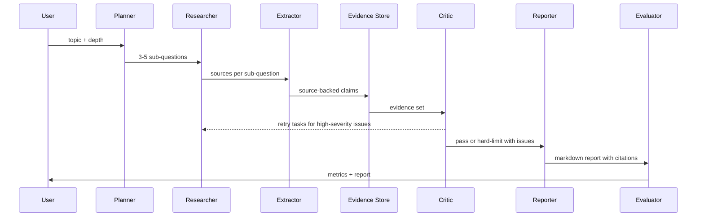

# Architecture

DeepResearchAgent is organized as a long-horizon research workflow with explicit quality gates.

## Core Contracts

- `ResearchPlan`: topic, depth, sub-questions, estimated sources, success criteria
- `Evidence`: claim, claim type, source URL/title/date, extract text, confidence
- `CriticReport`: pass/fail, quality score, issues, retry tasks, iteration
- `EvaluationResult`: task success, citation accuracy, critic catch rate, relevance, faithfulness, latency, cost, tokens

## Current MVP Boundaries

- Search is behind a `SearchProvider` boundary. The default implementation is a deterministic `FixtureSearchTool`; Tavily or Serper are future optional adapters, not required for local tests.
- State and evidence are persisted with `SQLiteStore` for the local MVP. `docs/postgres_schema.sql` documents the production storage path, but there is no Postgres adapter yet.
- FastAPI and the fallback stdlib server execute runs synchronously. The project does not yet include a background job queue.
- Checkpoint recovery is available through `research_id` and can be demonstrated with `scripts/run_checkpoint_demo.py`.

## State And Recovery

`SQLiteStore` persists checkpoints after every phase. A paused run stores the next phase, evidence collected so far, retry queue, Critic iteration, report draft, metrics, token count, and cost estimate. The engine can resume from `research_id` without discarding Evidence Store entries.

## Why Evidence Store Is First-Class

The project does not rely on vector memory as the source of truth. Each final claim must be backed by a structured `Evidence` row with an extract from the source. This makes citation verification, numeric conflict detection, and interview explanations concrete.
