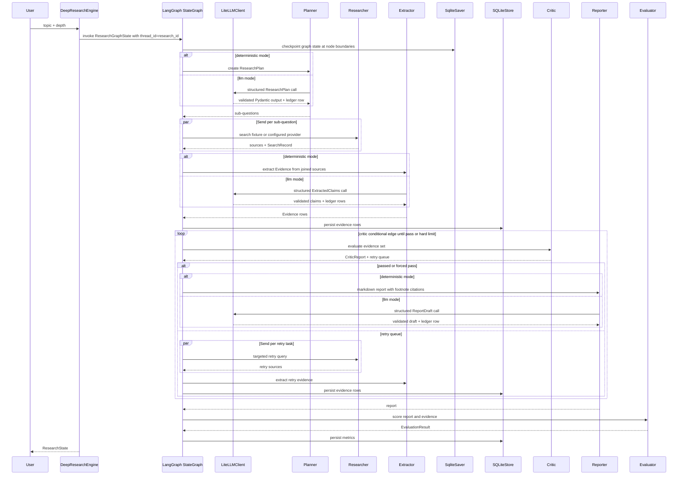

# Architecture

DeepResearchAgent is organized as a deterministic long-horizon research workflow with explicit quality gates and source-backed evidence.

## Current Execution Flow

The engine builds a LangGraph `StateGraph` in `src/deepresearch_agent/workflow/engine.py`. The graph has nodes for `planner`, `researcher`, `extractor`, `critic`, `reporter`, and `evaluator`, with small prepare/join nodes around fan-out. The graph state uses a `TypedDict` wrapper containing JSON-serializable `ResearchState` data so checkpoints do not depend on pickled Pydantic instances.

The runtime has two modes:

- `deterministic`: default, no API keys, deterministic local Planner/Extractor/Reporter.
- `llm`: opt-in, LiteLLM-backed Planner/Extractor/Reporter, deterministic fixture Researcher, deterministic Critic.

## Core Contracts

- `ResearchPlan`: topic, depth, sub-questions, estimated sources, success criteria
- `ResearchState`: workflow phase, status, plan, tasks, sources, evidence, critic report, report, metrics, token and cost estimates
- `Evidence`: claim, claim type, source URL/title/date, extract text, confidence
- `CriticReport`: pass/fail, quality score, issues, retry tasks, iteration
- `EvaluationResult`: task success, citation accuracy, critic catch rate, relevance, faithfulness, latency, cost, tokens

All cross-agent contracts are Pydantic models in `src/deepresearch_agent/schemas.py`.

## Current MVP Boundaries

- Search is behind a `SearchProvider` boundary. The default implementation is a deterministic `FixtureSearchTool`; Tavily is available as an opt-in adapter, while Serper is not implemented.
- Fetch has only a local fixture implementation through `FixtureSearchTool.fetch`; there is no robust live `web_fetch` yet.
- `rag_search` and `structured_query` are not implemented.
- Graph checkpoints are persisted by LangGraph's official `SqliteSaver`; evidence rows and evaluations are persisted with `SQLiteStore` for the local MVP. `docs/postgres_schema.sql` documents a production storage path, but there is no Postgres adapter yet.
- FastAPI and the fallback stdlib server execute runs synchronously. The project does not yet include a background job queue.
- Checkpoint recovery is available through `research_id` and can be demonstrated with `scripts/run_checkpoint_demo.py`.
- LiteLLM is used only through `deepresearch_agent.llm.LLMClient` in `llm` mode. No other module should call LiteLLM directly.

## Checkpoint And Storage Responsibilities

Checkpointing and storage are split intentionally:

- `SqliteSaver` owns LangGraph checkpoint tables such as `checkpoints` and `writes`, keyed by `thread_id`. The engine sets `thread_id` to `research_id`.
- `SQLiteStore` owns `evidence`: source-backed evidence rows keyed by evidence ID.
- `SQLiteStore` owns `evaluations`: serialized `EvaluationResult` keyed by `research_id`.

LangGraph checkpoints store the next graph node, current phase, evidence collected so far, retry queue, Critic iteration, report draft, metrics, token count, and cost estimate. The engine can resume from `research_id` without discarding Evidence Store entries.

## LangGraph Migration Status

LangGraph 1.2.2 is installed and active in the runtime path. `langgraph-checkpoint-sqlite` 3.1.0 provides `langgraph.checkpoint.sqlite.SqliteSaver`, which is used for orchestration checkpoints.

Researcher fan-out uses LangGraph `Send` per sub-question, then joins sources in plan order before extraction. Critic routing uses conditional edges: passed reports continue to Reporter, failed reports under the hard iteration limit fan out only the retry queue, and failed reports at the hard limit preserve the force-pass behavior.

## LLM Layer, Ledger, And Budget Fuse

`LLMClient` is the single LLM boundary. It receives a role name, chat messages, and an optional Pydantic schema. It applies a 60-second timeout, two provider retries with exponential backoff, and one structured-output repair retry that feeds validation errors back to the model.

The role-to-model mapping is centralized in `src/deepresearch_agent/llm_config.py`. The default temperature is 0. LLM keys are read only from `.env`.

Every LLM call appends one JSON line to `data/runtime/llm_ledger.jsonl`, including role, model, prompt/completion/total tokens, USD/CNY cost, latency, cache-hit field when present, repair attempts, and parse-error status. The directory is gitignored.

The per-run budget fuse defaults to 3 CNY and is configurable with `DEEPRESEARCH_LLM_BUDGET_CNY`. If cumulative run cost exceeds the budget, the engine marks the state `budget_exceeded`, preserves the latest checkpointed partial state, and stops gracefully.

In LLM mode, `token_used` and `cost_usd` come from ledger aggregation. `citation_accuracy` and `critic_catch_rate` remain programmatic. `answer_relevance` and `faithfulness` are reported as `null` with reason fields until a judge is added.

## Why Evidence Store Is First-Class

The project does not rely on vector memory as the source of truth. Each final claim must be backed by a structured `Evidence` row with an extract from the source. This makes citation verification, numeric conflict detection, and interview explanations concrete.
