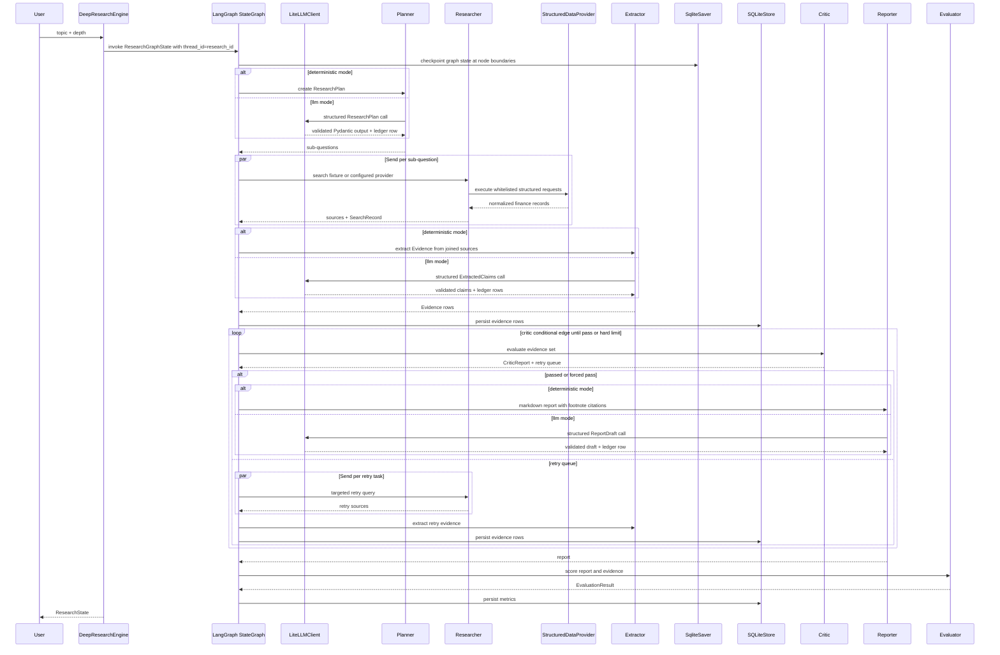

# Architecture

DeepResearchAgent is organized as a deterministic long-horizon research workflow with explicit quality gates and source-backed evidence.

## Current Execution Flow

```mermaid
sequenceDiagram
    participant User
    participant Engine as DeepResearchEngine
    participant Graph as LangGraph StateGraph
    participant LLM as LiteLLMClient
    participant Planner
    participant Researcher
    participant Data as StructuredDataProvider
    participant Extractor
    participant Saver as SqliteSaver
    participant Store as SQLiteStore
    participant Critic
    participant Reporter
    participant Evaluator

    User->>Engine: topic + depth
    Engine->>Graph: invoke ResearchGraphState with thread_id=research_id
    Graph->>Saver: checkpoint graph state at node boundaries
    alt deterministic mode
        Graph->>Planner: create ResearchPlan
    else llm mode
        Planner->>LLM: structured ResearchPlan call
        LLM-->>Planner: validated Pydantic output + ledger row
    end
    Planner-->>Graph: sub-questions
    par Send per sub-question
        Graph->>Researcher: search fixture or configured provider
        Researcher->>Data: execute whitelisted structured requests
        Data-->>Researcher: normalized finance records
        Researcher-->>Graph: sources + SearchRecord
    end
    alt deterministic mode
        Graph->>Extractor: extract Evidence from joined sources
    else llm mode
        Extractor->>LLM: structured ExtractedClaims call
        LLM-->>Extractor: validated claims + ledger rows
    end
    Extractor-->>Graph: Evidence rows
    Graph->>Store: persist evidence rows
    loop critic conditional edge until pass or hard limit
        Graph->>Critic: evaluate evidence set
        Critic-->>Graph: CriticReport + retry queue
        alt passed or forced pass
            alt deterministic mode
                Graph->>Reporter: markdown report with footnote citations
            else llm mode
                Reporter->>LLM: structured ReportDraft call
                LLM-->>Reporter: validated draft + ledger row
            end
        else retry queue
            par Send per retry task
                Graph->>Researcher: targeted retry query
                Researcher-->>Graph: retry sources
            end
            Graph->>Extractor: extract retry evidence
            Graph->>Store: persist evidence rows
        end
    end
    Reporter-->>Graph: report
    Graph->>Evaluator: score report and evidence
    Evaluator-->>Graph: EvaluationResult
    Graph->>Store: persist metrics
    Engine-->>User: ResearchState
```

The engine builds a LangGraph `StateGraph` in `src/deepresearch_agent/workflow/engine.py`. The graph has nodes for `planner`, `researcher`, `extractor`, `critic`, `reporter`, and `evaluator`, with small prepare/join nodes around fan-out. The graph state uses a `TypedDict` wrapper containing JSON-serializable `ResearchState` data so checkpoints do not depend on pickled Pydantic instances.

The runtime has two modes:

- `deterministic`: default, no API keys, deterministic local Planner/Extractor/Reporter.
- `llm`: opt-in, LiteLLM-backed Planner/Extractor/Reporter, deterministic fixture Researcher, deterministic Critic.

## Core Contracts

- `ResearchPlan`: topic, depth, sub-questions, estimated sources, success criteria
- `ResearchState`: workflow phase, status, plan, tasks, sources, evidence, critic report, report, metrics, token and cost estimates
- `Evidence`: claim, claim type, source URL/title/date, extract text, confidence, source kind, optional structured record, optional numeric fields
- `CriticReport`: pass/fail, quality score, issues, retry tasks, iteration
- `EvaluationResult`: task success, citation accuracy, critic catch rate, relevance, faithfulness, latency, cost, tokens

All cross-agent contracts are Pydantic models in `src/deepresearch_agent/schemas.py`.

## Current MVP Boundaries

- Search is behind a `SearchProvider` boundary. The default implementation is a deterministic `FixtureSearchTool`; Tavily is available as an opt-in adapter, while Serper is not implemented.
- Structured finance data is behind a `StructuredDataProvider` boundary. The default implementation is recorded fixture data; the live adapter uses AKShare only through whitelisted capabilities: `symbol_resolve`, `financial_indicators`, and `price_history`.
- Fetch has only a local fixture implementation through `FixtureSearchTool.fetch`; there is no robust live `web_fetch` yet.
- `rag_search` is not implemented.
- Graph checkpoints are persisted by LangGraph's official `SqliteSaver`; evidence rows and evaluations are persisted with `SQLiteStore` for the local MVP. `docs/postgres_schema.sql` documents a production storage path, but there is no Postgres adapter yet.
- FastAPI and the fallback stdlib server execute runs synchronously. The project does not yet include a background job queue.
- Checkpoint recovery is available through `research_id` and can be demonstrated with `scripts/run_checkpoint_demo.py`.
- LiteLLM is used only through `deepresearch_agent.llm.LLMClient` in `llm` mode. No other module should call LiteLLM directly.

## Checkpoint And Storage Responsibilities

Checkpointing and storage are split intentionally:

- `SqliteSaver` owns LangGraph checkpoint tables such as `checkpoints` and `writes`, keyed by `thread_id`. The engine sets `thread_id` to `research_id`.
- `SQLiteStore` owns `evidence`: source-backed evidence rows keyed by evidence ID, including structured finance records and numeric fields when present.
- `SQLiteStore` owns `evaluations`: serialized `EvaluationResult` keyed by `research_id`.

LangGraph checkpoints store the next graph node, current phase, evidence collected so far, retry queue, Critic iteration, report draft, metrics, token count, and cost estimate. The engine can resume from `research_id` without discarding Evidence Store entries.

## LangGraph Migration Status

LangGraph 1.2.2 is installed and active in the runtime path. `langgraph-checkpoint-sqlite` 3.1.0 provides `langgraph.checkpoint.sqlite.SqliteSaver`, which is used for orchestration checkpoints.

Researcher fan-out uses LangGraph `Send` per sub-question, then joins sources in plan order before extraction. Critic routing uses conditional edges: passed reports continue to Reporter, failed reports under the hard iteration limit fan out only the retry queue, and failed reports at the hard limit preserve the force-pass behavior.

## LLM Layer, Ledger, And Budget Fuse

`LLMClient` is the single LLM boundary. It receives a role name, chat messages, and an optional Pydantic schema. It applies a 60-second timeout, two provider retries with exponential backoff, and one structured-output repair retry that feeds validation errors back to the model.

The role-to-model mapping is centralized in `src/deepresearch_agent/llm_config.py`. The default temperature is 0. LLM keys are read only from `.env`.

Every LLM call appends one JSON line to `data/runtime/llm_ledger.jsonl`, including role, model, prompt/completion/total tokens, USD/CNY cost, latency, cache-hit field when present, repair attempts, and parse-error status. The directory is gitignored.

The per-run budget fuse defaults to 3 CNY and is configurable with `DEEPRESEARCH_LLM_BUDGET_CNY`. If cumulative run cost exceeds the budget, the engine marks the state `budget_exceeded`, preserves the latest checkpointed partial state, and stops gracefully.

In LLM mode, `token_used` and cost fields come from ledger aggregation. The native accounting currency is CNY under `price_source=v4flash_console_calibrated_20260612`; USD is a display field derived from CNY. `citation_accuracy` is reported as `null` because the current scorer is extractive-only, while `citation_resolution_rate` and `critic_catch_rate` remain programmatic. `answer_relevance` and `faithfulness` are reported as `null` with reason fields until a judge is added.

## Structured Finance Data And Critic Rules

Planner can attach optional `structured_data_requests` to sub-questions in LLM mode. Researcher executes those requests mechanically through `StructuredDataProvider`; no LLM decides whether a structured record is accepted after planning. Returned records are normalized to entity, symbol, metric name, period/timepoint, dimension, value, unit, data source, and `as_of` date, then stored as `Evidence` with `claim_type=data` and `source_kind=structured`.

Extractor can attach `numeric_fields` to numeric text claims. The five-element fact-checking key is entity, metric, period/timepoint, dimension, and value/unit. Missing entity, metric, or value on a data claim marks the evidence `numeric_fields_incomplete` but does not discard the claim.

Critic loads `data/finance_metric_normalization.json` to normalize finance terms. Revenue aliases such as `营收` and `营业总收入` map to `营业收入`; `归母净利润`, `净利润`, and `扣非净利润` remain distinct; `单季` and `累计` remain incomparable. `numeric_conflict` fires only when entity, normalized metric, period, and dimension all match and values differ beyond the configured relative tolerance. Text-vs-structured mismatches on the same four keys are high severity and label the official structured source inconsistency. `temporal_conflict` detects same-event claims with conflicting dates or periods.

## Why Evidence Store Is First-Class

The project does not rely on vector memory as the source of truth. Each final claim must be backed by a structured `Evidence` row with an extract from the source. This makes citation verification, numeric conflict detection, and interview explanations concrete.

## Domain Pack Boundary: Proposed, Not Yet Extracted

Task 010's coupling audit found financial behavior hard-coded in core Planner, Critic, Reporter, Researcher, and Golden audit code. There is therefore no `domains/finance` or `domains/competitive` package in the current implementation, and the repository does not claim domain independence yet.

The target domain contract has five file classes:

1. `tools/`: domain-specific provider adapters and capability declarations;
2. `prompts/`: Planner/Extractor/Critic/Reporter instructions selected by domain;
3. `templates/`: report layout, as-of label, and disclaimer text;
4. `eval/`: references to domain evaluation assets and scoring policy, without moving frozen data;
5. `domain.yaml`: domain id, capability registry, prompt/template versions, structured provider declaration, and eval references.

Adding a domain safely requires a `DomainSpec` protocol and registry first, characterization tests for the existing finance output, finance extraction with old-path compatibility and SHA-256 proof, then the new domain resources and a fixture/mock dry-run. Competitive intelligence must declare `structured_data_provider: null` until a real structured source exists. The full audit and extraction proposal are task evidence in `_collab/010_hardening-and-readme/domain_coupling_audit.md` and are intentionally not runtime claims.

## Hardening Layers And Default State

The hardening modules are additive. Default-off modules do not change the deterministic finance path.

| Layer | Code | Flag | Default | Runtime effect |
| --- | --- | --- | --- | --- |
| Typed tool execution | `tools/contracts.py`, `tools/reliable_execution.py` | `TOOL_CONTRACT_ENABLED` | `false` | Wraps search with run retry budget, circuit breaker, and degradation events |
| Untrusted content | `security/content.py` | `INJECTION_GUARD_ENABLED` | `false` | Wraps source text for model prompts, records patterns, reduces confidence, adds Critic issue |
| Run lineage | `provenance/manifest.py` | `RUN_MANIFEST_ENABLED` | `false` | Writes `runs/<run_id>/manifest.json` sidecar |
| Context packing | `context/packer.py` | `CONTEXT_PACKER_ENABLED` | `false` | Deduplicates/ranks evidence under Reporter budget and records drops |
| JSON logging | `observability/logging.py` | `STRUCTURED_LOGGING_ENABLED` | `false` | Emits redacted correlation-aware JSON events |
| Config fail-fast | `config_validation.py` | `CONFIG_FAIL_FAST_ENABLED` | `false` | Aggregates missing required configuration before engine construction |

Prompt drift validation is enabled in CI because it is a build-time guard, not a runtime behavior change. Read-only offline evaluation tools in `scripts/compare_runs.py`, `scripts/offline_metrics.py`, and `scripts/validate_golden_schema.py` never initiate research or modify Golden assets.
