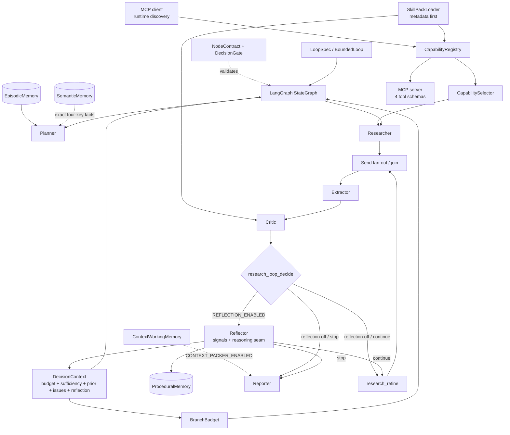
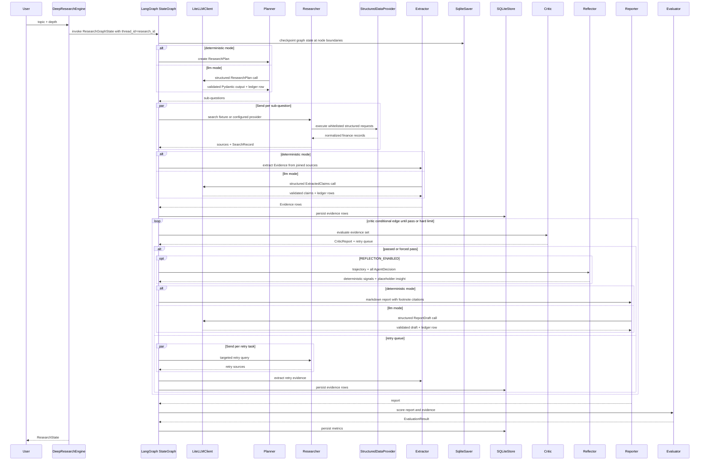
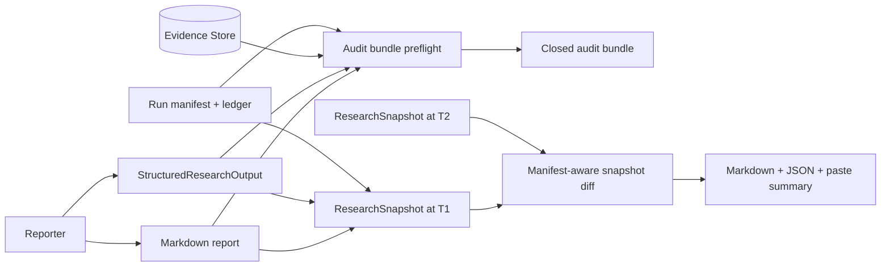

# Architecture

DeepResearchAgent is organized as a deterministic long-horizon research workflow with explicit quality gates and source-backed evidence.

## 编排控制面

```mermaid
flowchart TB
    NC["NodeContract + DecisionGate"] -. validates .-> G["LangGraph StateGraph"]
    LS["LoopSpec / BoundedLoop"] --> G
    BB["BranchBudget"] --> G
    DC["DecisionContext<br/>budget + sufficiency + prior + issues + reflection"] --> BB
    DC --> G
    EM[("EpisodicMemory")] --> P["Planner"]
    SM[("SemanticMemory")] -. exact four-key facts .-> P
    PM[("ProceduralMemory")]
    WM["ContextWorkingMemory"] -. CONTEXT_PACKER_ENABLED .-> RP["Reporter"]
    CR["CapabilityRegistry"] --> CS["CapabilitySelector"]
    MC["MCP client<br/>runtime discovery"] --> CR
    CR --> MS["MCP server<br/>4 tool schemas"]
    SK["SkillPackLoader<br/>metadata first"] --> CR
    SK --> C
    CS --> R["Researcher"]
    G --> P
    G --> R
    R --> J["Send fan-out / join"]
    J --> X["Extractor"]
    X --> C["Critic"]
    C --> D{"research_loop_decide"}
    D -->|reflection off / continue| RF["research_refine"]
    D -->|reflection off / stop| RP
    D -->|REFLECTION_ENABLED| FCT["Reflector<br/>signals + reasoning seam"]
    FCT --> PM
    FCT --> DC
    FCT -->|continue| RF
    RF --> J
    FCT -->|stop| RP
```

`NodeContract` 在图构建和每个节点边界强制消费、生产、不变式与决策记录；
LangGraph 仍是唯一执行器。`BranchBudget` 在 `Send` 前分配并在 join 后再分配。
`MemoryStore` 的情景/语义/程序实现保持确定性，工作记忆适配既有 context packer。
`DecisionContext` 是预算、充分性、上期分类与 Critic issue 的深只读快照，预算器、
循环器和重规划器读取同一事实视图。`CapabilityRegistry` 注册和查询能力；默认开启的
确定性 selector 在 Researcher fan-out 前按子问题类型选择当前可用能力。LLM 模式可另行
开启 provider-native tool selection，但候选和执行仍受同一 registry、预算与工具合同约束。
MCP client 把外部 `tools/list` 结果命名空间化后注册到同一 registry；MCP server 则把
本地 `ToolSpec` 机械映射为 stdio tool schema。`SkillPackLoader` 只在题面适用后读取
资源并注册 skill 能力；MCP 发现、skill 选择和加载均形成 `AgentDecision`。
Reflector 位于充分性决定与重规划/报告之间：只把机械信号送入 `DecisionContext`，
独立反思 LLM 推理接口仍是占位；程序记忆写入策略效果观察但不自动选策。

## Current Execution Flow

```mermaid
sequenceDiagram
    participant User
    participant Engine as DeepResearchEngine
    participant Graph as LangGraph StateGraph
    participant LLM as LiteLLMClient
    participant Planner
    participant Researcher
    participant Data as StructuredDataProvider
    participant Extractor
    participant Saver as SqliteSaver
    participant Store as SQLiteStore
    participant Critic
    participant Reflector
    participant Reporter
    participant Evaluator

    User->>Engine: topic + depth
    Engine->>Graph: invoke ResearchGraphState with thread_id=research_id
    Graph->>Saver: checkpoint graph state at node boundaries
    alt deterministic mode
        Graph->>Planner: create ResearchPlan
    else llm mode
        Planner->>LLM: structured ResearchPlan call
        LLM-->>Planner: validated Pydantic output + ledger row
    end
    Planner-->>Graph: sub-questions
    par Send per sub-question
        Graph->>Researcher: search fixture or configured provider
        Researcher->>Data: execute whitelisted structured requests
        Data-->>Researcher: normalized finance records
        Researcher-->>Graph: sources + SearchRecord
    end
    alt deterministic mode
        Graph->>Extractor: extract Evidence from joined sources
    else llm mode
        Extractor->>LLM: structured ExtractedClaims call
        LLM-->>Extractor: validated claims + ledger rows
    end
    Extractor-->>Graph: Evidence rows
    Graph->>Store: persist evidence rows
    loop critic conditional edge until pass or hard limit
        Graph->>Critic: evaluate evidence set
        Critic-->>Graph: CriticReport + retry queue
        alt passed or forced pass
            opt REFLECTION_ENABLED
                Graph->>Reflector: trajectory + all AgentDecision
                Reflector-->>Graph: deterministic signals + placeholder insight
            end
            alt deterministic mode
                Graph->>Reporter: markdown report with footnote citations
            else llm mode
                Reporter->>LLM: structured ReportDraft call
                LLM-->>Reporter: validated draft + ledger row
            end
        else retry queue
            par Send per retry task
                Graph->>Researcher: targeted retry query
                Researcher-->>Graph: retry sources
            end
            Graph->>Extractor: extract retry evidence
            Graph->>Store: persist evidence rows
        end
    end
    Reporter-->>Graph: report
    Graph->>Evaluator: score report and evidence
    Evaluator-->>Graph: EvaluationResult
    Graph->>Store: persist metrics
    Engine-->>User: ResearchState
```

The engine builds a LangGraph `StateGraph` in `src/deepresearch_agent/workflow/engine.py`.
The graph has domain nodes for Planner, Researcher, Extractor, Critic, Reporter,
and Evaluator; prepare/join nodes surround both fan-out paths, and
`research_loop_decide` / `research_refine` form the optional research back-edge.
The graph state uses a `TypedDict` wrapper containing JSON-serializable
`ResearchState` data so checkpoints do not depend on pickled Pydantic instances.

The runtime has two modes:

- `deterministic`: default, no API keys, deterministic local Planner/Extractor/Reporter.
- `llm`: opt-in, LiteLLM-backed Planner/Extractor/Reporter, configured fixture
  or live search/structured/disclosure providers, and deterministic Critic.

## Core Contracts

- `ResearchPlan`: topic, depth, sub-questions, estimated sources, success criteria
- `ResearchState`: workflow phase, status, plan, tasks, sources, evidence, critic report, report, metrics, token and cost estimates
- `Evidence`: claim, claim type, source URL/title/date, extract text, confidence, source kind, optional structured record, optional numeric fields
- `CriticReport`: pass/fail, quality score, issues, retry tasks, iteration
- `EvaluationResult`: task success, citation accuracy, critic catch rate, relevance, faithfulness, latency, cost, tokens
- `StructuredResearchOutput`: traceable comparison table, event timeline, and risk matrix
- `ResearchSnapshot`: business question/as-of, normalized claims, structured objects, manifest reference, and flag snapshot
- `AgentDecision`: actor, measured inputs, explicit criterion, outcome, alternatives, iteration, and timestamp
- `DecisionContext`: immutable budget, sufficiency, prior-classification, critic-issue, and preceding-decision snapshot
- `ReflectionResult`: deterministic cross-round signals plus a separately typed LLM insight seam
- `AgentTrajectory`: schema-v4 request/call/node/decision/artifact trace with a
  typed `completed | budget_exceeded | failed` terminal outcome; legacy schema
  v3 remains load/validation-compatible and has no `termination` object
- `NodeContract`: node consumes, produces, invariants, and optional decision gate
- `LoopSpec`: iteration, budget, no-progress bounds, progress metric, and exhaustion handler
- `MemoryStore`: typed write/query protocol with scope and lifecycle declarations
- `CapabilityRegistry`: capability metadata, deterministic query, and implementation resolution

Cross-agent data contracts are Pydantic models in `src/deepresearch_agent/schemas.py`;
control-plane protocols live under `orchestration/`, `memory/`, and `tools/`.

## Business Output And Follow-up Data Flow

The characterization snapshot in `tests/golden_output/` remains a test
baseline. The business `ResearchSnapshot` is a separate versionable artifact:

```mermaid
flowchart LR
    R["Reporter"] --> M["Markdown report"]
    R --> S["StructuredResearchOutput"]
    M --> A["Audit bundle preflight"]
    S --> A
    E[("Evidence Store")] --> A
    P["Run manifest + ledger"] --> A
    A --> B["Closed audit bundle"]
    M --> RS1["ResearchSnapshot at T1"]
    S --> RS1
    P --> RS1
    RS1 --> D["Manifest-aware snapshot diff"]
    RS2["ResearchSnapshot at T2"] --> D
    D --> O["Markdown + JSON + paste summary"]
```

`StructuredResearchOutput` is additive and gated by
`STRUCTURED_OUTPUT_ENABLED=true`. Every row carries `evidence_ids`; a row
without evidence must be marked `unverified`. Metric aliases reuse
`skills/finance-metric-normalization/resources/finance_metric_normalization.json`,
and mixed scopes for one normalized
metric are surfaced as a table conflict.

`scripts/export_audit_bundle.py` refuses to write an incomplete directory:
all report claim and structured-object evidence IDs must resolve before export.
`scripts/create_research_snapshot.py` writes the independent business schema;
`scripts/diff_snapshots.py` classifies six deterministic change types and
calls manifest comparability before business comparison. Scope changes are
matched before numeric changes, preventing a changed period definition from
being misreported as business growth or decline.

The existing Reporter contract returns one complete report. Task 012 therefore
uses the permitted API-layer downgrade for progressive delivery:
`PROGRESSIVE_DELIVERY_ENABLED=false` publishes ordered sections into the demo
job polling payload only after the report is complete, then byte-reassembles it
and checks citation closure. True per-section Reporter generation remains
unimplemented because it would change LLM calls, prompt semantics, and repair
behavior.

## Footnote mapping, decisions, and trajectory

Reporter assigns footnotes from the Evidence view it actually receives and
persists `report_footnote_evidence` with the report. Evaluator, audit export,
and characterization claim extraction resolve citations through that mapping;
they do not rebuild it from a later Evidence order. Historical states without
the field degrade explicitly instead of silently inferring a positional map.

`AgentDecision` has three audit landing points: structured run trace, manifest
summary, and a reader-visible report section. `DecisionContext` weaves the current
budget, sufficiency, prior classification and Critic issues into a common immutable
input. The bounded policies decide whether research continues, how branch capacity
is allocated, whether a sub-question is `verify` / `watch` / `explore`, how the
next query is refined, whether numeric relations reconcile, and which registered
capabilities a sub-question may use.
Reflector adds two auditable decisions: mechanical signal extraction and procedural-memory
write. Only deterministic signals enter `DecisionContext`; the placeholder `llm_insight`
cannot affect behavior. Round 033 observed no adopted procedural strategy, so this seam
still has no demonstrated reasoning benefit.
`TRAJECTORY_RECORD_ENABLED=false` is the default. When enabled, new recordings
use schema v4 and persist redacted LLM attempts, supported ToolSpec calls, node
transitions, decisions, artifacts, and a typed terminal outcome. Verified strict
replay for completed v4 runs consumes recorded LLM, search/fetch,
structured-data, and disclosure results without network access, fails closed on
missing calls or exact-prompt drift, and byte-compares the report artifact.
Round 031 A4f validated this path with a real-provider
Planner/Extractor/Reporter run. Legacy v3 remains read-only
load/validation-compatible. Schema-v4 `budget_exceeded` and `failed`
trajectories are persisted for audit but are currently non-replayable.
Strategy-level replay is not implemented.

The research-sufficiency back-edge, prior-period path, decision weaving, and numeric
consistency checking exist behind default-off `content_affecting` flags. Dynamic
capability selection is content-affecting and default-on; branch budgeting is also
default-on. Numeric checking sits inside Critic so an inconsistency
uses the existing retry path. Capability selection sits in `research_prepare`,
before fan-out, and the Researcher only consumes that selection. The 018 MCP
client and first skill pack now register through that same registry; their
skill-loading policy remains default-off.

## Current MVP Boundaries

- Search is behind a `SearchProvider` boundary. The default implementation is a deterministic `FixtureSearchTool`; Tavily is available as an opt-in adapter, while Serper is not implemented.
- Structured finance data is behind a `StructuredDataProvider` boundary. The default implementation is recorded fixture data; the live adapter uses AKShare only through whitelisted capabilities: `symbol_resolve`, `financial_indicators`, and `price_history`.
- Fetch has only a local fixture implementation through `FixtureSearchTool.fetch`; there is no robust live `web_fetch` yet.
- Search, fetch, structured data, and authoritative disclosure are registered in `CapabilityRegistry`; the default deterministic selector chooses an auditable subset per sub-question. The fixed set is an explicit fallback. Optional `LLM_TOOL_SELECTION_ENABLED` uses provider-native tool calling but cannot name or execute an unregistered capability.
- The stdio MCP server exposes four fixture tools; the MCP client can discover and register external tools, but the third-party handshake containing `tools/call` remains incomplete. There is no HTTP transport, authentication, or arbitrary filesystem/command tool.
- Skill loading is metadata-first and default-off. The finance normalization skill is distinct from the explicit finance DomainPack and does not create a second domain runtime.
- Episodic and semantic memory are in-process deterministic stores. They are not durable multi-process memory, vector retrieval, or an automatic forgetting system.
- Procedural memory is also an in-process deterministic `cross_run` index; it records strategy effects but does not learn, rank, or adopt a strategy.
- `rag_search` is not implemented.
- Graph checkpoints are persisted by LangGraph's official `SqliteSaver`; evidence rows and evaluations are persisted with `SQLiteStore` for the local MVP. `docs/postgres_schema.sql` documents a production storage path, but there is no Postgres adapter yet.
- The primary FastAPI and fallback stdlib research endpoints execute runs synchronously. Demo Golden reruns use a process-local worker and JSON polling store; this is not a durable distributed queue.
- Checkpoint recovery is available through `research_id` and can be demonstrated with `scripts/run_checkpoint_demo.py`.
- LiteLLM is used only through `deepresearch_agent.llm.LLMClient` in `llm` mode. No other module should call LiteLLM directly.

## Checkpoint And Storage Responsibilities

Checkpointing and storage are split intentionally:

- `SqliteSaver` owns LangGraph checkpoint tables such as `checkpoints` and `writes`, keyed by `thread_id`. The engine sets `thread_id` to `research_id`.
- `SQLiteStore` owns `evidence`: source-backed evidence rows keyed by evidence ID, including structured finance records and numeric fields when present.
- `SQLiteStore` owns `evaluations`: serialized `EvaluationResult` keyed by `research_id`.

LangGraph checkpoints store the next graph node, current phase, evidence collected so far, retry queue, Critic iteration, report draft, metrics, token count, and cost estimate. The engine can resume from `research_id` without discarding Evidence Store entries.

## LangGraph Migration Status

LangGraph 1.2.2 is installed and active in the runtime path. `langgraph-checkpoint-sqlite` 3.1.0 provides `langgraph.checkpoint.sqlite.SqliteSaver`, which is used for orchestration checkpoints.

Researcher fan-out uses LangGraph `Send` per sub-question, then joins sources in
plan order before extraction. Critic routing uses conditional edges: failed
reports under the hard iteration limit fan out only the retry queue, and failed
reports at the hard limit preserve the force-pass behavior. When
`RESEARCH_LOOP_ENABLED=true` and max iterations is greater than 1, a passed
Critic report enters `research_loop_decide`; insufficient research passes
through `research_refine` back to `research_prepare`. This is the project's first
native LangGraph conditional research loop. `LoopSpec` enforces maximum
iterations, total loop budget and no-progress bounds.

## LLM Layer, Ledger, And Budget Fuse

`LLMClient` is the single LLM boundary. It receives a role name, chat messages,
and an optional Pydantic schema. The base timeout is 60 seconds, with explicit
per-role overrides (the judge paths use 300 seconds); calls allow two provider
retries with exponential backoff and one structured-output repair retry that
feeds validation errors back to the model.

The role-to-model mapping is centralized in `src/deepresearch_agent/llm_config.py`.
The default temperature is 0. Provider keys are read from the process environment
or the untracked project `.env`; key values must never enter source, logs,
trajectories, reports, or manifests.

Every LLM call appends one JSON line to `data/runtime/llm_ledger.jsonl`, including role, model, prompt/completion/total tokens, USD/CNY cost, latency, cache-hit field when present, repair attempts, and parse-error status. The directory is gitignored.

The per-run budget fuse defaults to 3 CNY and is configurable with
`DEEPRESEARCH_LLM_BUDGET_CNY`. If cumulative run cost exceeds the budget, the
engine marks the state `budget_exceeded`, preserves the latest checkpointed
partial state, and stops gracefully. LLM-budget exhaustion checkpoints the
partial state and writes a schema-v4 `budget_exceeded` trajectory with phase and
error fields. Run-wide external-request exhaustion additionally emits a partial
report artifact. Unexpected exceptions persist a `failed` terminal trajectory
and failed checkpoint before the exception is re-raised.

In LLM mode, `token_used` and cost fields come from ledger aggregation. The
native accounting currency is CNY; each ledger row records the model-specific
`price_source`, and USD is only a display conversion. Mechanical
`citation_resolution_rate`, numeric audit, and `critic_catch_rate` remain
available. `citation_accuracy`, completeness, answer shape, semantic relevance,
and semantic faithfulness are populated only when the default-off runtime
semantic judge succeeds; otherwise nullable fields carry explicit reasons and
cannot erase a mechanical numeric failure.

## Structured Finance Data And Critic Rules

Planner can attach optional `structured_data_requests` to sub-questions in LLM mode. Researcher executes those requests mechanically through `StructuredDataProvider`; no LLM decides whether a structured record is accepted after planning. Returned records are normalized to entity, symbol, metric name, period/timepoint, dimension, value, unit, data source, and `as_of` date, then stored as `Evidence` with `claim_type=data` and `source_kind=structured`.

Extractor can attach `numeric_fields` to numeric text claims. The five-element fact-checking key is entity, metric, period/timepoint, dimension, and value/unit. Missing entity, metric, or value on a data claim marks the evidence `numeric_fields_incomplete` but does not discard the claim.

Critic loads the byte-identical rule resource from
`skills/finance-metric-normalization/resources/finance_metric_normalization.json`
to normalize finance terms. Revenue aliases such as `营收` and `营业总收入` map to
`营业收入`; `归母净利润`, `净利润`, and `扣非净利润` remain distinct; `单季` and
`累计` remain incomparable. `numeric_conflict` fires only when entity,
normalized metric, period, and dimension all match and values differ beyond the
configured relative tolerance. Text-vs-structured mismatches on the same four
keys are high severity and label the official structured source inconsistency.
`temporal_conflict` detects same-event claims with conflicting dates or periods.

## Why Evidence Store Is First-Class

The project does not rely on vector memory as the source of truth. Each final claim must be backed by a structured `Evidence` row with an extract from the source. This makes citation verification, numeric conflict detection, and interview explanations concrete.

## Domain Pack Boundary: Historical Starting Point and Current Boundary

Task 010's coupling audit found financial behavior hard-coded in core Planner,
Critic, Reporter, Researcher, providers, structured output, and evaluation code.
The current composition boundary resolves a `DomainPack` through
`domains/registry.py` and injects it into those consumers. Narrow protocols cover
planning, disclosure queries and titles, structured-data aliases, metric coverage,
table extraction, reporting, skill selection, and numeric checking/citations.

The finance implementation now owns the corresponding vocabulary, planning rules,
provider aliases, report rendering policies, table extractors, and numeric rules.
The core source tree has zero direct imports of `domains.finance`; the versioned
domain-boundary ratchet also limits remaining finance literals to 3 files and
9 lines. Those residuals are report formatting, immutable Golden audit assertions,
and a legacy serialization default, not hidden domain selection. Exact reasons and
removal conditions are recorded in
`docs/decisions/043/domain-boundary-residual.md`.

This is a real dependency inversion, but not a claim that the harness is already
domain-general: `finance` is the only registered product DomainPack. `NullDomainPack`
exists for deterministic boundary tests and cannot be selected as a production
domain. A new domain must implement the explicit protocol, register at the
composition boundary, declare its provider and evaluation assets, and pass
characterization plus full-gate tests without adding concrete-domain imports to
core.

## Hardening Layers And Default State

The hardening modules are additive. Default-off modules do not change the deterministic finance path.

| Layer | Code | Flag | Default | Runtime effect |
| --- | --- | --- | --- | --- |
| Typed tool execution | `tools/contracts.py`, `tools/reliable_execution.py` | `TOOL_CONTRACT_ENABLED` | `true` | Wraps search with run retry budget, circuit breaker, and degradation events |
| Untrusted content | `security/content.py` | `INJECTION_GUARD_ENABLED` | `false` | Wraps source text for model prompts, records patterns, reduces confidence, adds Critic issue |
| Run lineage | `provenance/manifest.py` | `RUN_MANIFEST_ENABLED` | `true` | Writes `runs/<run_id>/manifest.json` sidecar |
| Context packing | `context/packer.py` | `CONTEXT_PACKER_ENABLED` | `false` | Deduplicates/ranks evidence under Reporter budget and records drops |
| JSON logging | `observability/logging.py` | `STRUCTURED_LOGGING_ENABLED` | `true` | Emits redacted correlation-aware JSON events |
| Config fail-fast | `config_validation.py` | `CONFIG_FAIL_FAST_ENABLED` | `true` | Aggregates missing required configuration before engine construction |
| Structured business output | `structured_output.py` | `STRUCTURED_OUTPUT_ENABLED` | `true` | Adds tables/timeline/risk objects without replacing prose |
| API section progress | `progressive_delivery.py`, `api/demo.py` | `PROGRESSIVE_DELIVERY_ENABLED` | `false` | Adds polling sidecars; final report is byte-identical |
| Trajectory recording | `trajectory.py`, `trajectory_replay.py` | `TRAJECTORY_RECORD_ENABLED` | `false` | Writes redacted schema-v4 sidecars for completed, budget-exceeded, and failed runs; completed fixture runs and the Round 031 A4f real-LLM run have verified offline strict replay, while noncompleted trajectories are audit-only |
| Branch budget | `orchestration/budget.py` | `BRANCH_BUDGET_ENABLED` | `true` | Bounds per-run and per-branch search calls; records allocation decisions |
| Research sufficiency loop | `orchestration/loops.py`, `orchestration/research_loop.py` | `RESEARCH_LOOP_ENABLED` | `false` | Refines weak queries through a bounded native LangGraph back-edge |
| Prior research memory | `memory/prior.py` | `PRIOR_MEMORY_ENABLED` | `false` | Uses only the latest earlier snapshot to classify and verify sub-questions |
| Reflection skeleton | `reflection.py`, `memory/procedural.py` | `REFLECTION_ENABLED` | `false` | Extracts mechanical signals, invokes a zero-API reasoning placeholder, writes procedural observations, and can inform existing replanning |
| Skill packs | `skills/loader.py`, `skills/finance.py` | `SKILL_PACKS_ENABLED` | `false` | Selects from `SKILL.md` metadata, then loads resources and registers one capability |
| Deterministic capability selection | `tools/capability_selector.py` | `DYNAMIC_CAPABILITY_ENABLED` | `true` | Selects a registered capability subset per sub-question and records candidates, rejections, and fallback |
| LLM capability selection | `tools/capability_selector.py`, `llm/client.py` | `LLM_TOOL_SELECTION_ENABLED` | `false` | Uses provider-native tool calling for selection only; registry and run budgets still authorize execution |
| MCP integration | `mcp/server.py`, `mcp/client.py` | none | local fixture only | Exposes four stdio tools and discovers external tools through the existing registry and tool contract |

Prompt drift validation is enabled in CI because it is a build-time guard, not a runtime behavior change. Read-only offline evaluation tools in `scripts/compare_runs.py`, `scripts/offline_metrics.py`, and `scripts/validate_golden_schema.py` never initiate research or modify Golden assets.
