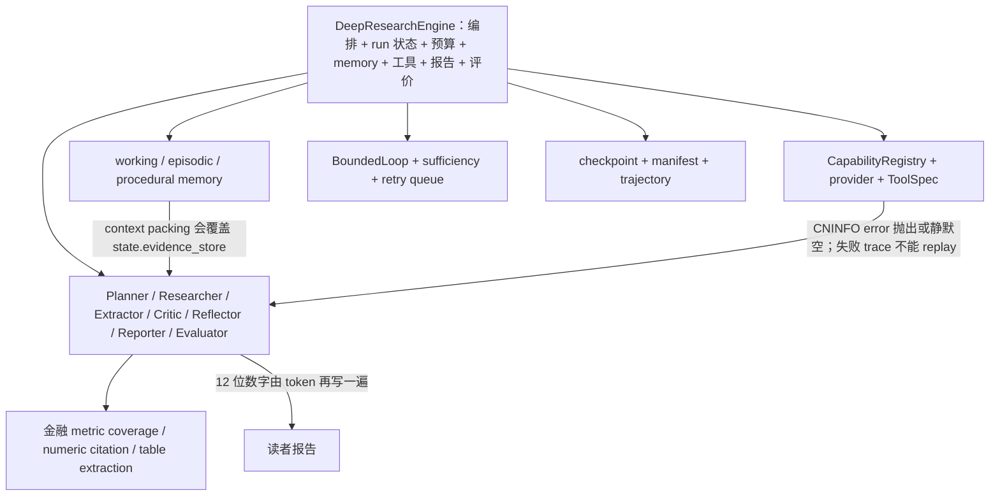
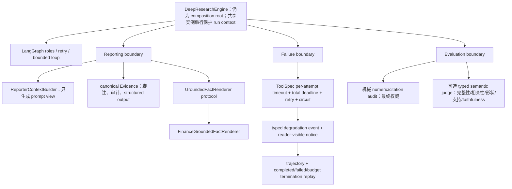

# 033 Agent 核心架构审计

## 结论

`DeepResearchEngine` 仍是上帝对象。本轮结束前的静态计数为 3,066 行、63 个类方法、
21 个 `deepresearch_agent` 直接导入模块；它同时拥有图构建、角色接线、run 生命周期、
预算、checkpoint、memory、工具上下文、失败持久化、报告后处理与评价。不能因为抽出
了几个模块就宣称这个问题已经解决。

与此同时，033 修复了三条有真实事故证据的架构边界：canonical Evidence 不再被
context packing 改写；关键事实从 typed Evidence 机械渲染；工具失败、降级与失败终态
进入统一 trace/replay 合同。它们比按文件大小任意拆分类更优先，因为分别直接对应
本轮有害消融、031 A5 错数和 031 限制 #5/#6。

## 改动前

主要问题：

- `engine.py` 对所有角色和大多数横切能力都有具体依赖，构造器不是 domain composition root。
- Working memory 把 prompt 预算视图写回 canonical store，导致报告脚注、审计与 structured
  output 一同丢 Evidence；真实消融观察到 7→5 和 7→6。
- Reporter 让 LLM 重抄已经正确进入 typed coverage 的长数字，031 A5 因而产生漏位。
- Dynamic-off 的所谓“固定工具集”没有 disclosure，且 web fetch 被 dynamic 开关错误地
  一并关掉，原消融不是公平 control。
- `timeout_s=120` 是单次尝试而非逻辑调用总 deadline；retry 可把用户等待放大。
- 失败 termination 记录了但 replay 提前判 cache miss，最需要复盘的轨迹反而不可执行。
- LLM Evaluator 直接把语义字段写成 `null`；Golden judge 是另一条离线链路，运行时从未调用，
  不是“模型输出未采用”，而是“运行链路根本未接通”。

## 改动后

实际重构：

1. 新增通用 `reporting.grounded_facts.GroundedFactRenderer` 合同，金融实现移到
   `domains/finance/grounded_facts.py`；Engine 构造器可注入其他领域 renderer。
2. 新增 `ReporterContextBuilder`。工作记忆只裁剪 LLM prompt view，canonical
   `state.evidence_store` 保持不变，脚注和保真渲染继续消费完整事实集。
3. Engine 的 run-wide budget、breaker 和 provider binding 仍是可变实例字段；在迁移到
   graph state 前以 `RLock` 串行共享实例，避免两个并发 run 交叉污染。它牺牲同实例吞吐，
   但其行为明确且已有并发移除验证。
4. 固定 capability control 补齐 disclosure 与 web fetch；dynamic selection 只决定选择，
   不再暗中改变固定工具的可执行语义。
5. Sufficiency 与 max-iteration 同时触发时，以 sufficiency 作为因果终止理由，同时把安全
   boundary 保留在 decision inputs；不会再把“已经足够”伪报成“因上限耗尽”。
6. Semantic judge 和 reporting context 从 Engine 抽成独立对象；Evaluator 只接收严格类型
   输出，机械数值失败不可被 judge 的高分覆盖。
7. Tool logical deadline、typed degradation、失败 termination replay 都在工具/trajectory
   边界实现，没有把 CNINFO 特例散到图路由中。

## 换领域需要改哪里

当前还不是“只加一个 domain pack 即可换领域”。对源码做关键词搜索得到 38 个可能含金融
耦合的文件；这是耦合面上界信号，不是精确的必改文件数。法律文书或医疗文献至少需要：

| 层 | 当前可复用 | 新领域仍需改/新增 |
|---|---|---|
| 编排 | `StateGraph`、NodeContract、DecisionGate、bounded loop、checkpoint | Planner 的问题分类和节点所需 domain contract |
| 工具可靠性 | ToolSpec、retry、deadline、breaker、budget、degradation、replay | 新的权威源 adapter、source tier 和 capability rules |
| 事实合同 | Evidence、footnote mapping、通用 renderer protocol | 法律条款/医疗结论的 typed fact schema 与 renderer |
| 生成 | prompt context/canonical store 分离、通用 Reporter 外壳 | domain prompt、允许/禁止的事实表达与 uncertainty policy |
| 批评与评价 | semantic judge 的通用五维、机械门优先原则 | 法条时效/病例适用性等领域机械审计、coverage contract |
| 记忆 | memory 接口和生命周期类型 | 能证明跨 run 策略采用有效的 domain key 与写入策略 |

因此本轮只能宣称“建立了第一个可注入领域保真接口”，不能宣称完成 finance domain-pack
抽取。下一步最小完整方案是先定义 `DomainPack`（planner policy、capability policy、typed
fact renderer、critic rules、evaluation rules 五个字段），把 finance 作为等价实现接入，
再用一个非金融双题 fixture 证明 Engine 无条件分支新增为零。

## 本卡未继续拆 `engine.py` 的理由

按行数拆分不是质量证据。本轮同时改变了报告事实边界、失败终态和 evaluator 生命周期；
继续大搬迁 63 个方法会让行为变化难以归因，并显著扩大 checkpoint/strict replay 回归面。
后续应在现有 characterization 上分三步完成：

1. 抽 `RunCoordinator`，让 budget/tool binding/sidecar persistence 成为每次 run 的对象而非
   Engine 实例字段，从而移除串行锁限制。
2. 把 research、report、evaluate 节点分别移到 `workflow/nodes/`，Engine 只构图和接线。
3. 引入上述 `DomainPack` composition root，再做 finance 等价快照和非金融 smoke。

这是明确的未交付，不是结构“已经足够好”的判断。
